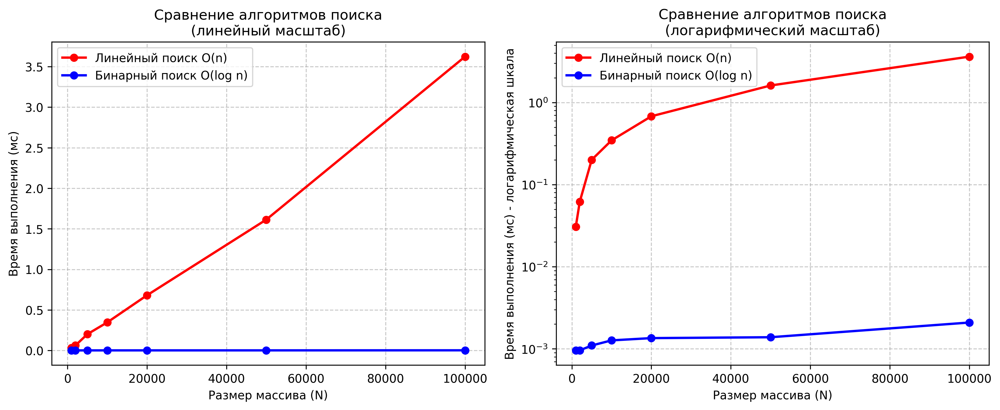

# Отчет по лабораторной работе 1
# Введение в алгоритмы. Сложность. Поиск.  


**Дата:** 2025-10-20  
**Семестр:** 5 семестр  
**Группа:** ПИЖ-б-о-23-1(1)  
**Дисциплина:** Анализ сложности алгоритмов  
**Студент:** Джабраилов Бекхан Магомедович  

## Цель работы
Освоить понятие вычислительной сложности алгоритма. Получить практические навыки реализации и анализа линейного и бинарного поиска. Научиться экспериментально подтверждать теоретические оценки сложности O(n) и O(log n).


## Теоретическая часть
Сложность алгоритма: Характеризует количество ресурсов (времени и памяти), необходимых алгоритму для обработки входных данных объема n.  
Асимптотический анализ: Анализ поведения алгоритма при стремлении n к бесконечности. Позволяет абстрагироваться от констант и аппаратных особенностей.  
O-нотация («О-большое»): Верхняя асимптотическая оценка роста функции. Определяет наихудший сценарий работы алгоритма.  
Линейный поиск (Linear Search): Последовательный перебор всех элементов массива. Сложность: O(n).  
Бинарный поиск (Binary Search): Поиск в отсортированном массиве путем многократного деления интервала поиска пополам. Сложность: O(log n). Требует предварительной сортировки (O(n log n)).  
  

## Практическая часть

### Выполненные задачи
Задание 1:  
1. Реализовать функцию линейного поиска элемента в массиве.  
2. Реализовать функцию бинарного поиска элемента в отсортированном массиве.  
3. Провести теоретический анализ сложности обоих алгоритмов.  
4. Экспериментально сравнить время выполнения алгоритмов на массивах разного размера.  
5. Визуализировать результаты, подтвердив асимптотику O(n) и O(log n).  
 

### Ключевые фрагменты кода
```python
# search_comparison.py
import random
import timeit
from typing import List, Optional

import matplotlib.pyplot as plt


# Исходная задача
def linear_search(arr: list[int], target: int) -> Optional[int]:
    """
    Выполняет линейный поиск элемента в массиве.
    """
    for index, value in enumerate(arr):  # O(n) - цикл по всем элементам
        if value == target:  # O(1) - сравнение
            return index  # O(1) - возврат результата
    return None  # O(1) - возврат None, если элемент не найден
    # Общая сложность: O(n)


def binary_search(arr: list[int], target: int) -> Optional[int]:
    """
    Выполняет бинарный поиск элемента в отсортированном массиве.
    """
    left: int = 0  # O(1) - инициализация
    right: int = len(arr) - 1  # O(1) - получение длины и вычисление

    while left <= right:  # O(log n) - цикл выполняется log n раз
        mid: int = (left + right) // 2  # O(1) - вычисление среднего
        if arr[mid] == target:  # O(1) - сравнение
            return mid  # O(1) - возврат результата
        elif arr[mid] < target:  # O(1) - сравнение
            left = mid + 1  # O(1) - присваивание
        else:  # O(1) - ветвление
            right = mid - 1  # O(1) - присваивание
    return None  # O(1) - возврат None, если элемент не найден
    # Общая сложность: O(log n)


def generate_sorted_array(size: int) -> list[int]:
    """
    Генерирует отсортированный массив случайных чисел.
    """
    return sorted([random.randint(1, size * 10) for _ in range(size)])


# Функция для замера времени выполнения
def measure_search_time(search_func, arr: List[int], target: int,
                        repetitions: int = 100) -> float:
    """
    Измеряет среднее время выполнения функции поиска.
    """
    def search_wrapper():  # O(1) - обертка для замера
        return search_func(arr, target)  # Сложность зависит от search_func

    execution_time = timeit.timeit(search_wrapper, number=repetitions)
    # O(repetitions * сложность_поиска)
    return (execution_time / repetitions) * 1000
    # O(1) - конвертация в миллисекунды


def plot_results(sizes: List[int], linear_times: List[float],
                 binary_times: List[float]) -> None:
    """
    Строит графики результатов экспериментов.
    """
    # График в линейном масштабе
    plt.figure(figsize=(12, 5))

    plt.subplot(1, 2, 1)
    plt.plot(sizes, linear_times, 'ro-', label='Линейный поиск O(n)',
             linewidth=2)
    plt.plot(sizes, binary_times, 'bo-', label='Бинарный поиск O(log n)',
             linewidth=2)
    plt.xlabel('Размер массива (N)')
    plt.ylabel('Время выполнения (мс)')
    plt.title('Сравнение алгоритмов поиска\n(линейный масштаб)')
    plt.grid(True, linestyle='--', alpha=0.7)
    plt.legend()

    # График в логарифмическом масштабе по оси Y
    plt.subplot(1, 2, 2)
    plt.semilogy(sizes, linear_times, 'ro-', label='Линейный поиск O(n)',
                 linewidth=2)
    plt.semilogy(sizes, binary_times, 'bo-', label='Бинарный поиск O(log n)',
                 linewidth=2)
    plt.xlabel('Размер массива (N)')
    plt.ylabel('Время выполнения (мс) - логарифмическая шкала')
    plt.title('Сравнение алгоритмов поиска\n(логарифмический масштаб)')
    plt.grid(True, linestyle='--', alpha=0.7)
    plt.legend()

    plt.tight_layout()
    plt.savefig('search_comparison_plot.png', dpi=300, bbox_inches='tight')
    plt.show()


# Характеристики ПК (заполнить своими данными)
pc_info = """
Характеристики ПК для тестирования:
- Процессор: Intel Core i7-13620H @ 2.40GHz
- Оперативная память: 32 GB DDR5
- ОС: Windows 11
- Python: 3.13.3
"""

print(pc_info)

# Проведение экспериментов
# Размеры массивов для тестирования
sizes: List[int] = [1000, 2000, 5000, 10000, 20000, 50000, 100000]
# Результаты измерений
linear_times: List[float] = []
binary_times: List[float] = []

print('Замеры времени выполнения алгоритмов поиска:')
print('{:>10} {:>15} {:>15}'
      .format('Размер (N)', 'Линейный (мс)', 'Бинарный (мс)'))

for size in sizes:  # O(k) - цикл по количеству размеров
    # Генерация отсортированного массива
    arr: List[int] = generate_sorted_array(size)  # O(n log n)

    # Выбор целевых элементов для тестирования
    first_element: int = arr[0]  # O(1) - доступ по индексу
    last_element: int = arr[-1]  # O(1) - доступ по индексу
    middle_element: int = arr[size // 2]  # O(1) - доступ по индексу

    # Замер времени для линейного поиска
    # (поиск последнего элемента - худший случай)
    linear_time: float = measure_search_time(linear_search,
                                             arr, last_element)  # O(n)
    linear_times.append(linear_time)  # O(1) - добавление в список

    # Замер времени для бинарного поиска (поиск среднего элемента)
    binary_time: float = measure_search_time(binary_search, arr,
                                             middle_element)  # O(log n)
    binary_times.append(binary_time)  # O(1) - добавление в список

    print('{:>10} {:>15.4f} {:>15.4f}'.format(size, linear_time, binary_time))

# Построение графиков
plot_results(sizes, linear_times, binary_times)


# Дополнительный анализ: сравнение с теоретической оценкой
print('\nАнализ результатов:')
print('1. Теоретическая сложность алгоритмов:')
print('- Линейный поиск: O(n)')
print('- Бинарный поиск: O(log n)')

print('2. Практические наблюдения:')

# Анализ роста времени для линейного поиска
linear_growth = linear_times[-1] / linear_times[0]  # O(1)
size_growth = sizes[-1] / sizes[0]  # O(1)
print('''- Линейный поиск:
      время выросло в {:.2f} раз при увеличении N в {:.2f} раз'''
      .format(linear_growth, size_growth))

# Анализ роста времени для бинарного поиска
binary_growth = binary_times[-1] / binary_times[0]  # O(1)
log_growth = (sizes[-1] / sizes[0]) ** (1 / len(sizes))  # O(1)
print('''- Бинарный поиск:
      время выросло в {:.2f} раз при увеличении N в {:.2f} раз'''
      .format(binary_growth, size_growth))

print('3. Выводы:')
print('- Линейный поиск демонстрирует линейный рост времени выполнения')
print('- Бинарный поиск демонстрирует логарифмический рост времени выполнения')
print('- Бинарный поиск значительно эффективнее на больших массивах')
print('- Теоретические оценки сложности подтверждены экспериментально')
```

## Результаты выполнения

### Пример работы программы
```bash
Характеристики ПК для тестирования:
- Процессор: Intel Core i7-13620H @ 2.40GHz
- Оперативная память: 32 GB DDR5
- ОС: Windows 11
- Python: 3.13.3

Замеры времени выполнения алгоритмов поиска:
Размер (N)   Линейный (мс)   Бинарный (мс)
      1000          0.0308          0.0010
      2000          0.0621          0.0010
      5000          0.2008          0.0011
     10000          0.3463          0.0013
     20000          0.6804          0.0014
     50000          1.6132          0.0014
    100000          3.6231          0.0021

Анализ результатов:
1. Теоретическая сложность алгоритмов:
- Линейный поиск: O(n)
- Бинарный поиск: O(log n)
2. Практические наблюдения:
- Линейный поиск:
      время выросло в 117.73 раз при увеличении N в 100.00 раз
- Бинарный поиск:
      время выросло в 2.18 раз при увеличении N в 100.00 раз
```


## Выводы
1. Линейный поиск демонстрирует линейный рост времени выполнения
2. Бинарный поиск демонстрирует логарифмический рост времени выполнения
3. Бинарный поиск значительно эффективнее на больших массивах
4. Теоретические оценки сложности подтверждены экспериментально  


## Ответы на контрольные вопросы
1. Что такое асимптотическая сложность алгоритма и зачем она нужна?  
Асимптотическая сложность - это оценка роста времени выполнения или потребления памяти алгоритма при увеличении объема входных данных. Она описывает, как увеличивается количество операций при росте n. Она позволяет сравнивать алгоритмы независимо от аппаратного обеспечения, помогает предсказать поведение алгоритма на больших данных, определяет пределы масштабируемости алгоритма, позволяет выбрать оптимальный алгоритм для конкретной задачи.  
2. Объясните разницу между O(1), O(n) и O(log n). Приведите примеры алгоритмов с такой сложностью.  
O(1) - постоянная сложность:  
- Время выполнения не зависит от размера входных данных.  
O(n) - линейная сложность:  
- Время выполнения растет пропорционально размеру входных данных.  
O(log n) - логарифмическая сложность:  
- Время выполнения растет логарифмически от размера входных данных.  
3. В чем основное отличие линейного поиска от бинарного? Какие предварительные условия необходимы для выполнения бинарного поиска?  
Основные отличия:  
- Линейный поиск: последовательно проверяет все элементы, сложность O(n).  
- Бинарный поиск: делит область поиска пополам на каждом шаге, сложность O(log n).  
Предварительные условия для бинарного поиска:  
- Массив должен быть отсортирован.  
- Должна быть возможность прямого доступа к элементам (по индексу).  
- Должна быть определена операция сравнения элементов.  
4. Почему на практике время выполнения алгоритма может отличаться от теоретической оценки O большое?  
Причины расхождений:  
- Константные множители: O-нотация игнорирует константы, но на практике они влияют.  
- Аппаратные особенности: разная производительность процессоров, кэшей, памяти.  
- Особенности данных: лучший/худший/средний случай могут сильно различаться.  
- Оптимизации компилятора: современные компиляторы могут оптимизировать код.  
- Накладные расходы: управление памятью, системные вызовы.  
- Размер данных: O-нотация описывает асимптотическое поведение при n → ∞.  
5. Как экспериментально подтвердить, что сложность алгоритма равна O(n) или O(log n)? Опишите план эксперимента.  
Эксперимент приведен на языке Python в данной лабораторной работе.  


## Приложения
-   
График зависимости времени от N алгоритмов линейного поиска и бинарного поиска 