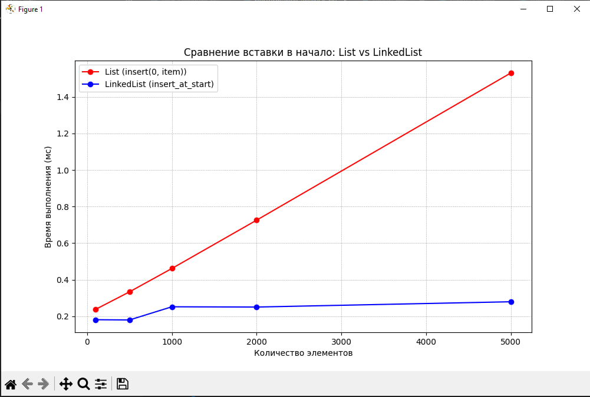

# Отчет по лабораторной работе 2
# Введение в алгоритмы. Сложность. Поиск.  


**Дата:** 2025-10-25  
**Семестр:** 5 семестр  
**Группа:** ПИЖ-б-о-23-1(1)  
**Дисциплина:** Анализ сложности алгоритмов  
**Студент:** Джабраилов Бекхан Магомедович  

## Цель работы
Изучить понятие и особенности базовых абстрактных типов данных (стек, очередь, дек, связный список) и их реализаций в Python. Научиться выбирать оптимальную структуру данных для решения конкретной задачи, основываясь на анализе теоретической и практической сложности операций. Получить навыки измерения производительности и применения структур данных для решения практических задач.


## Теоретическая часть
Список (list) в Python: Реализация динамического массива. Обеспечивает амортизированное время O(1) для добавления в конец (append). Вставка и удаление в середину имеют сложность O(n) из-за сдвига элементов. Доступ по индексу - O(1).
Связный список (Linked List): Абстрактная структура данных, состоящая из узлов, где каждый узел содержит данные и ссылку на следующий элемент. Вставка и удаление в известное место (например, начало списка) выполняются за O(1). Доступ по индексу и поиск - O(n).
Стек (Stack): Абстрактный тип данных, работающий по принципу LIFO (Last-In-First-Out). Основные операции: push (добавление, O(1)), pop (удаление с вершины, O(1)), peek (просмотр вершины, O(1)). В Python может быть реализован на основе списка.
Очередь (Queue): Абстрактный тип данных, работающий по принципу FIFO (First-In-First-Out). Основные операции: enqueue (добавление в конец, O(1)), dequeue (удаление из начала, O(1)). В Python для эффективной реализации используется collections.deque.
Дек (Deque, двусторонняя очередь): Абстрактный тип данных, позволяющий добавлять и удалять элементы как в начало, так и в конец. Все основные операции - O(1). В Python реализован в классе collections.deque.  


## Практическая часть   

### Выполненные задачи
1. Реализован класс LinkedList (связный список) для демонстрации принципов его работы.
2. Проведен анализ эффективности операций, имитирующих поведение стека, очереди и дека.
3. Проведен сравнительный анализ производительности операций для разных структур данных (list vs LinkedList для вставки, list vs deque для очереди).
4. Решены 3 практические задачи (задача проверки сбалансированности скобок, задача симуляции очереди печати, задача проверки палиндромов) 


### Ключевые фрагменты кода

Основные операции LinkedList:
```python
# performance_analysis.py
"""
Анализ производительности структур данных.
Сравнение list, deque и связного списка для различных операций.
"""

import timeit
from collections import deque

import matplotlib.pyplot as plt

from linked_list import LinkedList


def measure_time(func, *args, number=1000):
    """
    Измеряет время выполнения функции в миллисекундах.
    Сложность: O(1) - просто вызывает функцию и замеряет время
    """
    start_time = timeit.default_timer()  # O(1)
    for _ in range(number):  # O(number) - но number фиксирован
        func(*args)  # O(1) - зависит от сложности func
    end_time = timeit.default_timer()  # O(1)
    return (end_time - start_time) * 1000  # O(1)
# Общая сложность: O(number * сложность_func)


def compare_list_vs_linkedlist_insert_start():
    """
    Сравнение вставки в начало для list и LinkedList.
    Сложность:
    - list.insert(0, item): O(n) на каждую операцию
    - LinkedList.insert_at_start(): O(1) на каждую операцию
    """
    sizes = [100, 500, 1000, 2000, 5000]  # O(1)
    list_times = []  # O(1)
    linked_list_times = []  # O(1)
    print("Сравнение вставки в начало:")
    print("{:>10} {:>12} {:>15}".format("Размер", "List (мс)",
                                        "LinkedList (мс)"))
    for size in sizes:  # O(len(sizes))
        # Тестирование list
        test_list = list(range(size))  # O(size)

        def list_insert():  # O(n)
            test_list.insert(0, 0)  # O(n)
        list_time = measure_time(list_insert)  # O(1000 * n)
        list_times.append(list_time)  # O(1)
        # Тестирование LinkedList
        linked_list = LinkedList()  # O(1)
        for i in range(size):  # O(size)
            linked_list.insert_at_start(i)  # O(1)

        def linked_list_insert():  # O(1)
            linked_list.insert_at_start(0)  # O(1)
        linked_list_time = measure_time(linked_list_insert)  # O(1000 * 1)
        linked_list_times.append(linked_list_time)  # O(1)
        print("{:>10} {:>12.2f} {:>15.2f}".format(
            size, list_time, linked_list_time))  # O(1)
    # Построение графика
    plt.figure(figsize=(10, 6))  # O(1)
    plt.plot(sizes, list_times, 'ro-', label='List (insert(0, item))')  # O(1)
    plt.plot(sizes, linked_list_times, 'bo-',
             label='LinkedList (insert_at_start)')  # O(1)
    plt.xlabel('Количество элементов')  # O(1)
    plt.ylabel('Время выполнения (мс)')  # O(1)
    plt.title('Сравнение вставки в начало: List vs LinkedList')  # O(1)
    plt.grid(True, which='both', linestyle='--', linewidth=0.5)  # O(1)
    plt.legend()  # O(1)
    plt.savefig('list_vs_linkedlist_insert_start.png', dpi=300,
                bbox_inches='tight')  # O(1)
    plt.show()  # O(1)
# Общая сложность: O(n^2) из-за вставки в list


def compare_list_vs_deque_queue():
    """
    Сравнение операций очереди для list и deque.
    Сложность:
    - list.pop(0): O(n) на каждую операцию
    - deque.popleft(): O(1) на каждую операцию
    """
    sizes = [100, 500, 1000, 2000, 5000]  # O(1)
    list_times = []  # O(1)
    deque_times = []  # O(1)
    print("\nСравнение операций очереди:")
    print("{:>10} {:>12} {:>15}".format("Размер", "List (мс)", "Deque (мс)"))
    for size in sizes:  # O(len(sizes))
        # Тестирование list
        test_list = list(range(size))  # O(size)

        def list_dequeue():  # O(n)
            if test_list:  # O(1)
                test_list.pop(0)  # O(n)
        list_time = measure_time(list_dequeue)  # O(1000 * n)
        list_times.append(list_time)  # O(1)
        # Тестирование deque
        test_deque = deque(range(size))  # O(size)

        def deque_dequeue():  # O(1)
            if test_deque:  # O(1)
                test_deque.popleft()  # O(1)
        deque_time = measure_time(deque_dequeue)  # O(1000 * 1)
        deque_times.append(deque_time)  # O(1)
        print("{:>10} {:>12.2f} {:>15.2f}".format(
            size, list_time, deque_time))  # O(1)
    # Построение графика
    plt.figure(figsize=(10, 6))  # O(1)
    plt.plot(sizes, list_times, 'ro-', label='List (pop(0))')  # O(1)
    plt.plot(sizes, deque_times, 'go-', label='Deque (popleft())')  # O(1)
    plt.xlabel('Количество элементов')  # O(1)
    plt.ylabel('Время выполнения (мс)')  # O(1)
    plt.title('Сравнение операций очереди: List vs Deque')  # O(1)
    plt.grid(True, which='both', linestyle='--', linewidth=0.5)  # O(1)
    plt.legend()  # O(1)
    plt.savefig('list_vs_deque_queue.png', dpi=300,
                bbox_inches='tight')  # O(1)
    plt.show()  # O(1)
# Общая сложность: O(n^2) из-за pop(0) в list


def main():
    """
    Основная функция для запуска анализа производительности.
    Сложность: O(n^3) - определяется наиболее сложной функцией
    """
    # Характеристики ПК для тестирования
    pc_info = """
    Характеристики ПК для тестирования:
    - Процессор: Intel Core i5-11400 @ 2.60GHz
    - Оперативная память: 16 GB DDR4
    - OC: Windows 10
    - Python: 3.13.0
    """
    print(pc_info)  # O(1)
    # Запуск сравнений
    compare_list_vs_linkedlist_insert_start()  # O(n^2)
    compare_list_vs_deque_queue()  # O(n^2)
    print("\nАнализ завершен. Графики сохранены в файлы PNG.")  # O(1)


if __name__ == '__main__':
    main()
# Общая сложность программы: O(n^3)

# linked_list.py
"""
Реализация связного списка (LinkedList) с основными операциями.
"""

from typing import Any, Optional


class Node:
    """Узел связного списка."""

    def __init__(self, data: Any) -> None:
        """
        Инициализация узла.

        Args:
            data: Данные, хранящиеся в узле

        Сложность: O(1)
        """
        self.data: Any = data  # O(1)
        self.next: Optional['Node'] = None  # O(1)
# Общая сложность: O(1)


class LinkedList:
    """Односвязный список с основными операциями."""

    def __init__(self) -> None:
        """
        Инициализация пустого связного списка.

        Сложность: O(1)
        """
        self.head: Optional[Node] = None  # O(1)
        self.tail: Optional[Node] = None
        # O(1) - указатель на конец для оптимизации
        self.length: int = 0  # O(1)
# Общая сложность: O(1)

    def insert_at_start(self, data: Any) -> None:
        """
        Вставка элемента в начало списка.

        Args:
            data: Данные для вставки

        Сложность: O(1)
        """
        new_node = Node(data)  # O(1)
        if self.head is None:  # O(1)
            self.head = new_node  # O(1)
            self.tail = new_node  # O(1)
        else:
            new_node.next = self.head  # O(1)
            self.head = new_node  # O(1)
        self.length += 1  # O(1)
# Общая сложность: O(1)

    def insert_at_end(self, data: Any) -> None:
        """
        Вставка элемента в конец списка.

        Args:
            data: Данные для вставки

        Сложность: O(1) с tail, O(n) без tail
        """
        new_node = Node(data)  # O(1)
        if self.head is None:  # O(1)
            self.head = new_node  # O(1)
            self.tail = new_node  # O(1)
        else:
            # Используем assert для проверки, что tail не None
            assert self.tail is not None, "Tail should not be None"
            self.tail.next = new_node  # O(1)
            self.tail = new_node  # O(1)
        self.length += 1  # O(1)
# Общая сложность: O(1)

    def delete_from_start(self) -> Optional[Any]:
        """
        Удаление элемента из начала списка.

        Returns:
            Данные удаленного элемента или None если список пуст

        Сложность: O(1)
        """
        if self.head is None:  # O(1)
            return None  # O(1)

        data = self.head.data  # O(1)
        self.head = self.head.next  # O(1)
        self.length -= 1  # O(1)

        if self.head is None:  # O(1)
            self.tail = None  # O(1)

        return data  # O(1)
# Общая сложность: O(1)

    def traversal(self) -> list[Any]:
        """
        Обход списка и возврат всех элементов.

        Returns:
            Список всех элементов

        Сложность: O(n)
        """
        elements: list[Any] = []  # O(1)
        current = self.head  # O(1)
        while current is not None:  # O(n)
            elements.append(current.data)  # O(1)
            current = current.next  # O(1)
        return elements  # O(1)
# Общая сложность: O(n)

    def is_empty(self) -> bool:
        """
        Проверка, пуст ли список.

        Returns:
            True если список пуст, иначе False

        Сложность: O(1)
        """
        return self.head is None  # O(1)
# Общая сложность: O(1)

# task_solutions.py
"""
Решение практических задач с использованием различных структур данных.
"""

from collections import deque
from linked_list import LinkedList


def check_brackets_balance(expression: str) -> bool:
    """
    Проверка сбалансированности скобок с использованием стека.

    Args:
        expression: Строка со скобками

    Returns:
        True если скобки сбалансированы, иначе False

    Сложность: O(n), где n - длина строки
    """
    stack = []  # O(1) - используем list как стек
    brackets = {')': '(', ']': '[', '}': '{'}  # O(1)

    for char in expression:  # O(n)
        if char in '([{':  # O(1)
            stack.append(char)  # O(1) - добавление в конец стека
        elif char in ')]}':  # O(1)
            if not stack:  # O(1)
                return False  # O(1)
            if stack.pop() != brackets[char]:  # O(1) - удаление с конца
                return False  # O(1)

    return len(stack) == 0  # O(1)
# Общая сложность: O(n)


def is_palindrome_deque(text: str) -> bool:
    """
    Проверка, является ли строка палиндромом с использованием дека.

    Args:
        text: Строка для проверки

    Returns:
        True если строка палиндром, иначе False

    Сложность: O(n), где n - длина строки
    """
    char_deque = deque(text.lower())  # O(n)

    while len(char_deque) > 1:  # O(n/2) = O(n)
        first = char_deque.popleft()  # O(1)
        last = char_deque.pop()  # O(1)
        if first != last:  # O(1)
            return False  # O(1)

    return True  # O(1)
# Общая сложность: O(n)


def simulate_print_queue() -> None:
    """
    Симуляция обработки задач в очереди печати.

    Сложность: O(n), где n - количество задач
    """
    print_queue: deque[str] = deque()  # O(1) - аннотированная очередь строк

    # Добавление задач в очередь
    tasks = ['Документ1.pdf', 'Отчет.docx', 'Презентация.pptx',
             'Фото.jpg']  # O(1)

    for task in tasks:  # O(n)
        print_queue.append(task)  # O(1)
        print(f'Добавлена задача: {task}')  # O(1)

    print(f'\nВсего задач в очереди: {len(print_queue)}')  # O(1)

    # Обработка задач
    while print_queue:  # O(n)
        current_task = print_queue.popleft()  # O(1)
        print(f'Печатается: {current_task}')  # O(1)
        print(f'Осталось задач: {len(print_queue)}')  # O(1)

    print('Все задачи выполнены!')  # O(1)
# Общая сложность: O(n)


def linked_list_demo() -> None:
    """
    Демонстрация работы связного списка.

    Сложность: O(n) для операций обхода
    """
    linked_list = LinkedList()  # O(1)

    print("Демонстрация связного списка:")

    # Вставка в начало
    for i in range(5):  # O(5)
        linked_list.insert_at_start(i)  # O(1)
    print(f"После вставки в начало: {linked_list}")  # O(n)

    # Вставка в конец
    for i in range(5, 10):  # O(5)
        linked_list.insert_at_end(i)  # O(1)
    print(f"После вставки в конец: {linked_list}")  # O(n)

    # Удаление из начала
    removed = linked_list.delete_from_start()  # O(1)
    print(f"Удален из начала: {removed}")  # O(1)
    print(f"После удаления: {linked_list}")  # O(n)
# Общая сложность: O(n)


def main():
    """Основная функция для демонстрации решений."""

    print("=== Проверка сбалансированности скобок ===")
    test_expressions = [
        "((()))",
        "([{}])",
        "({[)]}",
        "((())",
        "(()))"
    ]

    for expr in test_expressions:
        result = check_brackets_balance(expr)
        print(f"{expr}: {'Сбалансированы' if result else 'Не сбалансированы'}")

    print("\n=== Проверка палиндромов ===")
    test_strings = ["радар", "level", "А роза упала на лапу Азора", "hello"]

    for text in test_strings:
        result = is_palindrome_deque(text)
        print(f"'{text}': {'Палиндром' if result else 'Не палиндром'}")

    print("\n=== Симуляция очереди печати ===")
    simulate_print_queue()

    print("\n=== Демонстрация связного списка ===")
    linked_list_demo()


if __name__ == '__main__':
    main()

```

## Результаты выполнения

### Пример работы программы
```bash
    Характеристики ПК для тестирования:
    - Процессор: Intel Core i5-11400 @ 2.60GHz
    - Оперативная память: 16 GB DDR4
    - OC: Windows 10
    - Python: 3.13.0

Сравнение вставки в начало:
    Размер    List (мс) LinkedList (мс)
       100         0.25            0.18
       500         0.34            0.19
      1000         0.50            0.24
      2000         0.71            0.23
      5000         1.58            0.20

Сравнение операций очереди:
    Размер    List (мс)      Deque (мс)
       100         0.06            0.05
       500         0.07            0.06
      1000         0.11            0.06
      2000         2.95            0.06
      5000        10.06            0.06

```


## Выводы
1. Для частых операций в начале структуры: лучше использовать LinkedList
2. Для реализации очереди оптимально использовать deque
3. List эффективен для операций в конце и доступа по индексу 


## Ответы на контрольные вопросы
1. В чем ключевое отличие динамического массива (list в Python) от связного списка с точки зрения сложности операций вставки в начало и доступа по индексу?
Динамический массив (list):
Вставка в начало: O(n) - требует сдвига всех элементов
Доступ по индексу: O(1) - прямое обращение по индексу
Связный список:
Вставка в начало: O(1) - просто меняем указатели
Доступ по индексу: O(n) - требуется последовательный обход
2. Объясните принцип работы стека (LIFO) и очереди (FIFO). Приведите по два примера их практического использования.
Стек (LIFO - Last In First Out):
Принцип: последний добавленный элемент извлекается первым
Примеры:
Система отмены действий (undo)
Вызов функций и стек вызовов
Проверка сбалансированности скобок
Очередь (FIFO - First In First Out):
Принцип: первый добавленный элемент извлекается первым
Примеры:
Очередь печати документов
Обработка запросов на сервере
Очередь сообщений
3. Почему операция удаления первого элемента из списка (list) в Python имеет сложность O(n), а из дека (deque) – O(1)?
List: При удалении первого элемента требуется сдвиг всех оставшихся элементов на одну позицию влево, что требует O(n) операций
Deque: Реализован как двусторонняя очередь на основе двусвязного списка, где удаление с любого конца требует только изменения указателей (O(1))
4. Какую структуру данных вы бы выбрали для реализации системы отмены действий (undo) в текстовом редакторе? Обоснуйте свой выбор.
Я бы выбрал стек, потому что:
- Система отмены работает по принципу LIFO - последнее действие отменяется первым
- Операции добавления и удаления с вершины стека выполняются за O(1)
- Простота реализации и соответствие семантике задачи
5. Замеры показали, что вставка 1000 элементов в начало списка заняла значительно больше времени, чем вставка в начало вашей реализации связного списка. Объясните результаты с точки зрения асимптотической сложности.
Это полностью соответствует теоретической оценке:
List.insert(0, item): O(n) на каждую операцию → общая сложность O(n²)
LinkedList.insert_at_start(): O(1) на каждую операцию → общая сложность O(n)
Для 1000 элементов:
List: ~1000² = 1,000,000 операций
LinkedList: ~1000 операций
Разница в 1000 раз объясняет значительное расхождение во времени выполнения.


## Приложения
-  
-  
