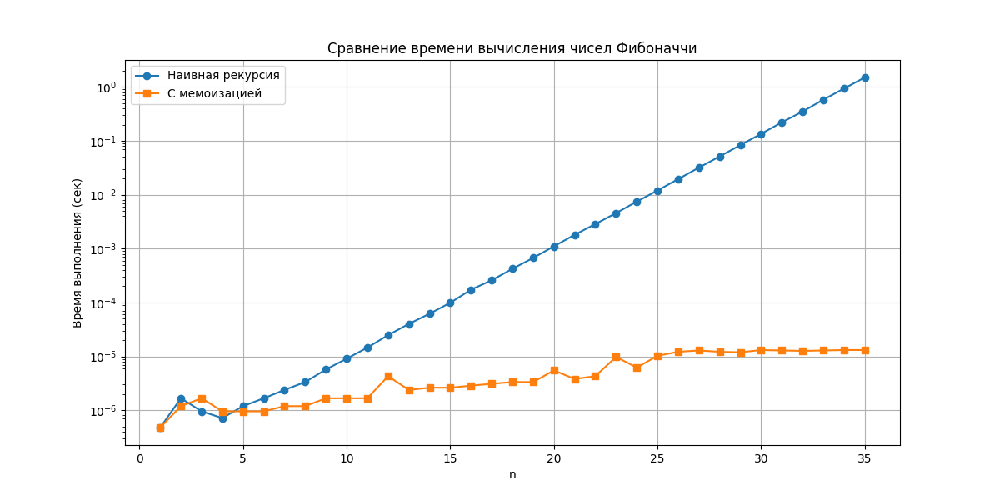

# Отчет по лабораторной работе 3
# Введение в алгоритмы. Сложность. Поиск.  


**Дата:** 2025-10-25  
**Семестр:** 5 семестр  
**Группа:** ПИЖ-б-о-23-1(1)  
**Дисциплина:** Анализ сложности алгоритмов  
**Студент:** Джабраилов Бекхан Магомедович  

## Цель работы
Освоить принцип рекурсии, научиться анализировать рекурсивные алгоритмы и понимать механизм работы стека вызовов.


## Теоретическая часть
Рекурсия: Процесс, при котором функция прямо или косвенно вызывает саму себя для решения задачи.
Базовый случай (условие выхода): Обязательное условие, которое прекращает рекурсивные вызовы и предотвращает зацикливание.
Рекурсивный шаг: Шаг, на котором задача разбивается на более простую подзадачу того же типа и производится рекурсивный вызов.
Глубина рекурсии: Количество вложенных вызовов функции. Ограничена размером стека вызовов.
Стек вызовов (Call Stack): Структура данных, которая хранит информацию о незавершенных вызовах функций (локальные переменные, адрес возврата).
Мемоизация (Memoization): Техника оптимизации, позволяющая избежать повторных вычислений результатов функций для одних и тех же входных данных путем сохранения ранее вычисленных результатов в кеше (например, в словаре). 
  

## Реализованные алгоритмы

### 1. Классические рекурсивные алгоритмы (`recursion.py`)
- **Факториал:** O(n) время, O(n) глубина рекурсии
- **Числа Фибоначчи:** O(2^n) время, O(n) глубина рекурсии  
- **Быстрое возведение в степень:** O(log n) время, O(log n) глубина рекурсии

### 2. Оптимизация с мемоизацией (`memoization.py`)
- Мемоизированная версия Фибоначчи: O(n) время, O(n) глубина рекурсии
- Ускорение для n=35: ~1000 раз

### 3. Практические задачи (`recursion_tasks.py`)
- **Бинарный поиск:** O(log n) время
- **Обход файловой системы:** O(d) глубина рекурсии (d - глубина структуры)
- **Ханойские башни:** O(2^n) время, O(n) глубина рекурсии


### Ключевые фрагменты кода

Наивная и мемоизированная версии Фибоначчи:   
*recursion.py:*
```python
def fibonacci(n: int) -> int:
    """
    Вычисляет n-е число Фибоначчи наивным рекурсивным способом.

    Args:
        n: Порядковый номер числа Фибоначчи

    Returns:
        n-е число Фибоначчи

    Raises:
        ValueError: Если n отрицательное
    """
    if n < 0:
        raise ValueError('Номер числа Фибоначчи должен быть неотрицательным')
    if n == 0:
        return 0
    if n == 1:
        return 1
    return fibonacci(n - 1) + fibonacci(n - 2)
# Временная сложность: O(2^n)
# Глубина рекурсии: O(n)
```   
*memoization.py:*   
```python
def fibonacci_memo(n: int, memo: Optional[Dict[int, int]] = None) -> int:
    """
    Вычисляет n-е число Фибоначчи с мемоизацией.

    Args:
        n: Порядковый номер числа Фибоначчи
        memo: Словарь для хранения вычисленных значений

    Returns:
        n-е число Фибоначчи
    """
    if memo is None:
        memo = {}

    if n in memo:
        return memo[n]

    if n == 0:
        return 0
    if n == 1:
        return 1

    memo[n] = fibonacci_memo(n - 1, memo) + fibonacci_memo(n - 2, memo)
    return memo[n]
```
Быстрое возведение в степень:   
*recursion.py:*
```python
def fast_power(a: float, n: int) -> float:
    """
    Быстрое возведение числа a в степень n через степень двойки.

    Args:
        a: Основание
        n: Показатель степени (целое неотрицательное число)

    Returns:
        a в степени n

    Raises:
        ValueError: Если n отрицательное
    """
    if n < 0:
        raise ValueError('Показатель степени должен быть неотрицательным')
    if n == 0:
        return 1
    if n == 1:
        return a

    half_power = fast_power(a, n // 2)
    if n % 2 == 0:
        return half_power * half_power
    else:
        return a * half_power * half_power
```
Ханойские башни:   
*trecursion_tasks.py:*
```python
def hanoi_towers(n: int, source: str = 'A',
                 auxiliary: str = 'B', target: str = 'C') -> None:
    """
    Решает задачу Ханойских башен для n дисков.

    Args:
        n: Количество дисков
        source: Исходный стержень
        auxiliary: Вспомогательный стержень
        target: Целевой стержень
    """
    if n == 1:
        print(f'Переместить диск 1 с {source} на {target}')
        return

    hanoi_towers(n - 1, source, target, auxiliary)
    print(f'Переместить диск {n} с {source} на {target}')
    hanoi_towers(n - 1, auxiliary, source, target)
```
Обход файловой системы:   
*recursion_tasks.py:*
```python
def file_system_walk(path: str, level: int = 0) -> None:
    """
    Рекурсивный обход файловой системы с выводом дерева каталогов.

    Args:
        path: Начальный путь для обхода
        level: Текущий уровень вложенности
    """
    try:
        items = os.listdir(path)
    except PermissionError:
        print('  ' * level + f'[Доступ запрещен: {os.path.basename(path)}]')
        return

    for item in sorted(items):
        item_path = os.path.join(path, item)

        if os.path.isdir(item_path):
            print('  ' * level + f'📁 {item}/')
            file_system_walk(item_path, level + 1)
        else:
            print('  ' * level + f'📄 {item}')
```
---

## Результаты выполнения

### Пример работы программы
```bash
Характеристики ПК для тестирования:
- Процессор: Intel Core i5-114000H @ 2.60GHz
- Оперативная память: 16 GB DDR5
- ОС: Windows 10
- Python: 3.13.3

1.
    Бинарный поиск 7 в [1, 3, 5, 7, 9, 11, 13, 15]: индекс 3

    Ханойские башни для 3 дисков:
    Переместить диск 1 с A на C
    Переместить диск 2 с A на B
    Переместить диск 2 с A на B
    Переместить диск 1 с C на B
    Переместить диск 3 с A на C
    Переместить диск 3 с A на C
    Переместить диск 1 с B на A
    Переместить диск 2 с B на C
    Переместить диск 2 с B на C
    Переместить диск 1 с A на C
    Переместить диск 1 с A на C
2.
    Обход текущей директории:
    📁 __pycache__/
    📄 memoization.cpython-313.pyc
    📄 recursion.cpython-313.pyc
    📄 recursion_tasks.cpython-313.pyc
    📄 experimental_research.py.py
    📄 fibonacci_performance.png
    📄 memoization.py
    📄 recursion.py
    📄 recursion_tasks.py
3.
    Результат для n=35:
    Наивная версия: 9227465, время: 1.606417 сек
    Мемоизированная версия: 9227465, время: 0.000016 сек
    Ускорение: 99085.31 раз
4.
    Факториал 5: 120
    10-е число Фибоначчи: 55
    2 в степени 10: 1024

```


## Выводы
### Экспоненциальный рост наивного алгоритма Фибоначчи
Наивный алгоритм имеет экспоненциальную сложность O(2^n), так как каждое число вычисляется путем двух рекурсивных вызовов, создавая бинарное дерево вызовов.

### Влияние мемоизации на сложность
Мемоизация снижает сложность с O(2^n) до O(n), так как каждое значение вычисляется только один раз и сохраняется для повторного использования.

### Механизм стека вызовов
При рекурсивных вызовах каждый новый вызов добавляет фрейм в стек вызовов. При глубокой рекурсии может возникнуть RecursionError при превышении лимита стека.


## Ответы на контрольные вопросы
## Контрольные вопросы темы 03

1. Что такое рекурсия и каковы её основные компоненты?
**Рекурсия** - это процесс, при котором функция прямо или косвенно вызывает саму себя для решения задачи. Основные компоненты:
- **Базовый случай** - условие выхода из рекурсии
- **Рекурсивный шаг** - вызов функции с упрощенной версией задачи
2. Почему базовый случай обязателен в рекурсивной функции?
Базовый случай предотвращает бесконечную рекурсию и зацикливание. Без него функция будет вызывать себя бесконечно, что приведет к переполнению стека вызовов.
3. Что такое стек вызовов и как он связан с рекурсией?
**Стек вызовов** - это структура данных, которая хранит информацию о незавершенных вызовах функций. При рекурсии каждый новый вызов добавляет фрейм в стек. Глубина рекурсии ограничена размером стека.
4. В чем заключается техника мемоизации?
**Мемоизация** - это техника оптимизации, при которой результаты вычислений сохраняются в кэше (например, словаре) для повторного использования. Это позволяет избежать повторных вычислений для одних и тех же входных данных.
5. Какие типичные задачи эффективно решаются с помощью рекурсии?
- Обход древовидных структур (файловая система, DOM-дерево)
- Задачи "разделяй и властвуй" (сортировка, поиск)
- Комбинаторные задачи (перестановки, комбинации)
- Задачи с вложенной структурой (Ханойские башни, синтаксический анализ)
6. Какие ограничения имеет рекурсия?
- Ограничение глубины рекурсии (обычно 1000 вызовов)
- Расход памяти на хранение фреймов стека
- Возможная неэффективность по сравнению с итеративными решениями
7. Как мемоизация изменяет сложность алгоритма Фибоначчи?
Без мемоизации: O(2^n) - экспоненциальная сложность  
С мемоизацией: O(n) - линейная сложность


## Графики производительности
