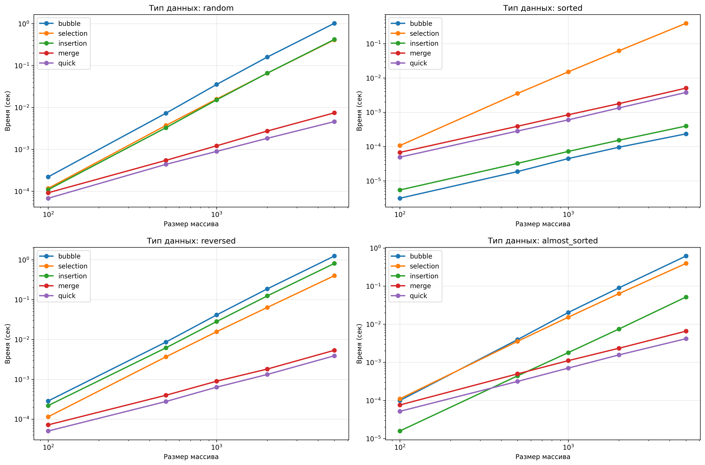
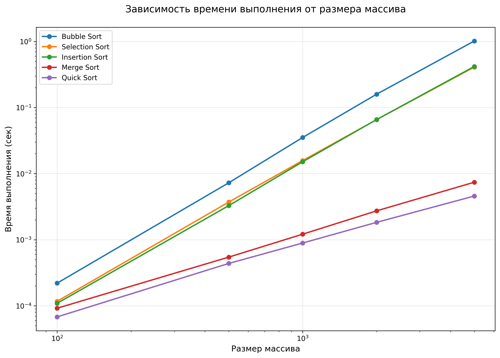
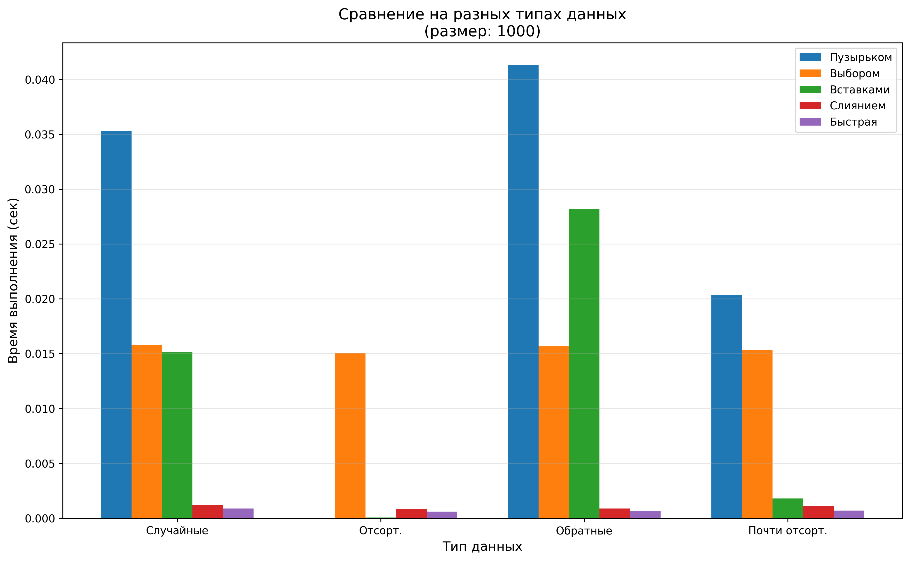

# Отчет по лабораторной работе 4
# Введение в алгоритмы. Сложность. Поиск.  


**Дата:** 2025-10-25  
**Семестр:** 5 семестр  
**Группа:** ПИЖ-б-о-23-1(1)  
**Дисциплина:** Анализ сложности алгоритмов  
**Студент:** Джабраилов Бекхан Магомедович  

## Цель работы
Изучить и реализовать основные алгоритмы сортировки. Провести их теоретический и практический сравнительный анализ по временной и пространственной сложности. Исследовать влияние начальной упорядоченности данных на эффективность алгоритмов. Получить навыки эмпирического анализа производительности алгоритмов.


## Теоретическая часть
Сортировка пузырьком (Bubble Sort): Многократно проходит по массиву, сравнивая и меняя
местами соседние элементы. Сложность: O(n²) во всех случаях.
Сортировка выбором (Selection Sort): На каждом проходе находит минимальный элемент из неотсортированной части и ставит его на очередную позицию. Сложность: O(n²).
Сортировка вставками (Insertion Sort): Построение окончательного массива путем пошагового вставления каждого элемента в правильную позицию в уже отсортированной части. Сложность:
O(n²) в худшем и среднем, O(n) в лучшем (уже отсортированный массив).
Сортировка слиянием (Merge Sort): Рекурсивный алгоритм "разделяй и властвуй". Массив разбивается на две части, которые сортируются рекурсивно, а затем сливаются в один отсортированный массив. Сложность: O(n log n) во всех случаях. Требует O(n) дополнительной памяти.
Быстрая сортировка (Quick Sort): Рекурсивный алгоритм "разделяй и властвуй". Выбирается опорный элемент, массив разделяется на элементы меньше и больше опорного, которые сортируются рекурсивно. Сложность: O(n log n) в среднем, O(n²) в худшем случае (плохой выбор опорного элемента). 
Сортировка на месте, не требует дополнительной памяти. 


## Реализованные алгоритмы

### 1. Сортировка пузырьком (Bubble Sort)
- **Сложность**: O(n²) во всех случаях
- **Пространственная**: O(1)
- **Устойчивость**: Да

### 2. Сортировка выбором (Selection Sort)
- **Сложность**: O(n²) во всех случаях  
- **Пространственная**: O(1)
- **Устойчивость**: Нет

### 3. Сортировка вставками (Insertion Sort)
- **Сложность**: O(n²) в худшем/среднем, O(n) в лучшем
- **Пространственная**: O(1)
- **Устойчивость**: Да

### 4. Сортировка слиянием (Merge Sort)
- **Сложность**: O(n log n) во всех случаях
- **Пространственная**: O(n)
- **Устойчивость**: Да

### 5. Быстрая сортировка (Quick Sort)
- **Сложность**: O(n log n) в среднем, O(n²) в худшем
- **Пространственная**: O(log n)
- **Устойчивость**: Нет


### Ключевые фрагменты кода

Сортировка пузырьком:   
*sorts.py:*
```python
def bubble_sort(arr: List[int]) -> List[int]:
    """
    Сортировка пузырьком.

    Временная сложность:
    - Лучший случай: O(n)
    - Средний случай: O(n²)
    - Худший случай: O(n²)

    Пространственная сложность: O(1)
    """
    n = len(arr)
    for i in range(n):
        swapped = False
        for j in range(0, n - i - 1):
            if arr[j] > arr[j + 1]:
                arr[j], arr[j + 1] = arr[j + 1], arr[j]
                swapped = True
        if not swapped:
            break
    return arr
```   
---
Сортировка выбором:   
*sorts.py:*   
```python
def selection_sort(arr: List[int]) -> List[int]:
    """
    Сортировка выбором.

    Временная сложность:
    - Лучший случай: O(n²)
    - Средний случай: O(n²)
    - Худший случай: O(n²)

    Пространственная сложность: O(1)
    """
    n = len(arr)
    for i in range(n):
        min_idx = i
        for j in range(i + 1, n):
            if arr[j] < arr[min_idx]:
                min_idx = j
        arr[i], arr[min_idx] = arr[min_idx], arr[i]
    return arr
```
---
Сортировка вставками:   
*sorts.py:*
```python
def insertion_sort(arr: List[int]) -> List[int]:
    """
    Сортировка вставками.

    Временная сложность:
    - Лучший случай: O(n)
    - Средний случай: O(n²)
    - Худший случай: O(n²)

    Пространственная сложность: O(1)
    """
    for i in range(1, len(arr)):
        key = arr[i]
        j = i - 1
        while j >= 0 and key < arr[j]:
            arr[j + 1] = arr[j]
            j -= 1
        arr[j + 1] = key
    return arr
```
---
Сортировка слиянием:   
*sorts.py:*
```python
def merge_sort(arr: List[int]) -> List[int]:
    """
    Сортировка слиянием.

    Временная сложность:
    - Лучший случай: O(n log n)
    - Средний случай: O(n log n)
    - Худший случай: O(n log n)

    Пространственная сложность: O(n)
    """
    if len(arr) <= 1:
        return arr

    mid = len(arr) // 2
    left = merge_sort(arr[:mid])
    right = merge_sort(arr[mid:])

    return _merge(left, right)
```
---
Быстрая сортировка:   
*sorts.py:*
```python
def quick_sort(arr: List[int]) -> List[int]:
    """
    Быстрая сортировка.

    Временная сложность:
    - Лучший случай: O(n log n)
    - Средний случай: O(n log n)
    - Худший случай: O(n²)

    Пространственная сложность: O(log n)
    """
    if len(arr) <= 1:
        return arr

    pivot = arr[len(arr) // 2]
    left = [x for x in arr if x < pivot]
    middle = [x for x in arr if x == pivot]
    right = [x for x in arr if x > pivot]

    return quick_sort(left) + middle + quick_sort(right)
```
---

## Результаты выполнения

### Пример работы программы
```bash
Характеристики ПК для тестирования:
- Процессор: Intel Core i5-114000H @ 2.60GHz
- Оперативная память: 16 GB DDR5
- ОС: Windows 10
- Python: 3.13.3

=== ТЕСТИРОВАНИЕ КОРРЕКТНОСТИ ===

--- Small array: [64, 34, 25, 12, 22, 11, 90] ---
Bubble Sort    : ✓ OK
Selection Sort : ✓ OK
Insertion Sort : ✓ OK
Merge Sort     : ✓ OK
Quick Sort     : ✓ OK

--- Already sorted: [1, 2, 3, 4, 5, 6, 7] ---
Bubble Sort    : ✓ OK
Selection Sort : ✓ OK
Insertion Sort : ✓ OK
Merge Sort     : ✓ OK
Quick Sort     : ✓ OK

--- Reverse sorted: [7, 6, 5, 4, 3, 2, 1] ---
Bubble Sort    : ✓ OK
Selection Sort : ✓ OK
Insertion Sort : ✓ OK
Merge Sort     : ✓ OK
Quick Sort     : ✓ OK

--- With duplicates: [3, 1, 4, 1, 5, 9, 2, 6, 5] ---
Bubble Sort    : ✓ OK
Selection Sort : ✓ OK
Insertion Sort : ✓ OK
Merge Sort     : ✓ OK
Quick Sort     : ✓ OK

=== ТЕСТИРОВАНИЕ ПРОИЗВОДИТЕЛЬНОСТИ ===


============================================================
СВОДНАЯ ТАБЛИЦА РЕЗУЛЬТАТОВ
============================================================
Алгоритм     Тип данных       100      500     1000     2000     5000
----------------------------------------------------------------------
bubble       almost_sorted  0.0001   0.0035   0.0177   0.0776   0.5047
bubble       random        0.0002   0.0067   0.0306   0.1303   0.8472
bubble       reversed      0.0003   0.0079   0.0368   0.1561   1.0348
bubble       sorted        0.0000   0.0000   0.0000   0.0001   0.0002
----------------------------------------------------------------------
insertion    almost_sorted  0.0000   0.0004   0.0020   0.0073   0.0452
insertion    random        0.0001   0.0030   0.0140   0.0567   0.3765
insertion    reversed      0.0002   0.0058   0.0260   0.1108   0.7235
insertion    sorted        0.0000   0.0000   0.0001   0.0001   0.0003
----------------------------------------------------------------------
merge        almost_sorted  0.0001   0.0005   0.0010   0.0023   0.0064
merge        random        0.0001   0.0005   0.0012   0.0025   0.0074
merge        reversed      0.0001   0.0004   0.0008   0.0017   0.0050
merge        sorted        0.0001   0.0004   0.0008   0.0017   0.0047
----------------------------------------------------------------------
quick        almost_sorted  0.0001   0.0003   0.0007   0.0015   0.0041
quick        random        0.0001   0.0005   0.0009   0.0017   0.0044
quick        reversed      0.0000   0.0003   0.0006   0.0013   0.0038
quick        sorted        0.0000   0.0003   0.0006   0.0013   0.0038
----------------------------------------------------------------------
selection    almost_sorted  0.0001   0.0032   0.0134   0.0530   0.3533
selection    random        0.0001   0.0032   0.0137   0.0571   0.3506
selection    reversed      0.0001   0.0032   0.0139   0.0568   0.3479
selection    sorted        0.0001   0.0030   0.0132   0.0553   0.3383
----------------------------------------------------------------------

```


## Выводы
Для небольших массивов (<100) простые алгоритмы эффективны  
Для больших случайных данных Quick Sort и Merge Sort оптимальны  
Для почти отсортированных данных Insertion Sort предпочтителен  
Когда важна стабильность - используйте Merge Sort


## Ответы на контрольные вопросы
## Контрольные вопросы темы 04

1. Какие алгоритмы сортировки имеют сложность O(n²) в худшем случае, а какие - O(n log n)?  
O(n²) в худшем случае:  
Сортировка пузырьком (Bubble Sort)  
Сортировка выбором (Selection Sort)  
Сортировка вставками (Insertion Sort)  
Быстрая сортировка (Quick Sort) - в худшем случае при неудачном выборе опорного элемента  
O(n log n) в худшем случае:  
Сортировка слиянием (Merge Sort)  
Пирамидальная сортировка (Heap Sort) - не рассматривалась в работе, но имеет такую сложность  
2. Почему сортировка вставками (Insertion Sort) эффективна для маленьких или почти отсортированных массивов?  
Сортировка вставками эффективна для маленьких массивов потому что:  
Имеет низкие накладные расходы  
Проста в реализации  
Для малых n константные множители преобладают над асимптотической сложностью  
Для почти отсортированных массивов:  
В лучшем случае (уже отсортированный массив) имеет сложность O(n)  
Каждый элемент вставляется за постоянное время, так как находится почти на своем месте  
Количество сравнений и перестановок минимально  
3. В чем разница между устойчивой (stable) и неустойчивой (unstable) сортировкой? Приведите пример устойчивого и неустойчивого алгоритма.  
Устойчивая сортировка сохраняет относительный порядок элементов с одинаковыми ключами.  
Неустойчивая сортировка может изменить относительный порядок элементов с одинаковыми ключами.  
Примеры:  
Устойчивые: сортировка вставками, сортировка слиянием, сортировка пузырьком  
Неустойчивые: сортировка выбором, быстрая сортировка  
4. Опишите принцип работы алгоритма быстрой сортировки (Quick Sort). Что такое "опорный элемент" и как его выбор влияет на производительность?  
Принцип работы:  
Выбирается опорный элемент (pivot)  
Массив разбивается на три части: элементы меньше pivot, равные pivot, больше pivot  
Рекурсивно применяется алгоритм к подмассивам меньше и больше pivot  
Опорный элемент - это элемент, относительно которого происходит разделение массива.  
Влияние выбора pivot на производительность:  
Хороший выбор (медиана) дает сложность O(n log n)  
Плохой выбор (минимальный или максимальный элемент) приводит к O(n²)  
Стратегии выбора: случайный элемент, медиана трех, средний элемент  
5. Сортировка слиянием (Merge Sort) гарантирует время O(n log n), но требует дополнительной памяти. В каких ситуациях этот алгоритм предпочтительнее быстрой сортировки?  
Сортировка слиянием предпочтительнее когда:  
Требуется стабильность - сохраняет порядок равных элементов  
Предсказуемость времени - всегда O(n log n), нет худшего случая O(n²)  
Работа с внешней памятью - хорошо подходит для сортировки больших файлов  
Параллельная обработка - легко распараллеливается  
Связанные списки - эффективно работает со связными списками  


## Графики производительности
   


