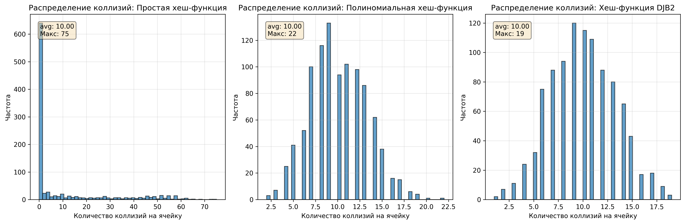
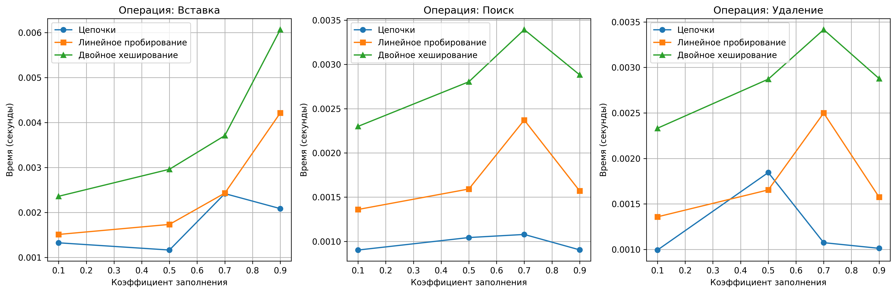

# Отчет по лабораторной работе 5
# Введение в алгоритмы. Сложность. Поиск.  


**Дата:** 2025-10-25  
**Семестр:** 5 семестр  
**Группа:** ПИЖ-б-о-23-1(1)  
**Дисциплина:** Анализ сложности алгоритмов  
**Студент:** Джабраилов Бекхан Магомедович  

## Цель работы
Изучить принципы работы хеш-функций и хеш-таблиц. Освоить методы разрешения коллизий. Получить практические навыки реализации хеш-таблицы с различными стратегиями разрешения коллизий. Провести сравнительный анализ эффективности разных методов.


## Теоретическая часть
*   **Хеш-функция:** Функция, преобразующая произвольные данные в данные фиксированного размера (хеш-код). Требования: детерминированность, равномерное распределение, скорость вычисления.
*   **Хеш-таблица:** Структура данных, реализующая ассоциативный массив. Обеспечивает в среднем O(1) для операций вставки, поиска и удаления.
*   **Коллизия:** Ситуация, когда разные ключи имеют одинаковый хеш-код.
*   **Метод цепочек (Chaining):** Каждая ячейка таблицы содержит список элементов с одинаковым хешем. Сложность: O(1 + α), где α - коэффициент заполнения.
*   **Открытая адресация (Open Addressing):** Все элементы хранятся в самом массиве. При коллизии ищется следующая свободная ячейка согласно probe sequence.
*   **Двойное хеширование (Double Hashing):** Метод открытой адресации, использующий вторую хеш-функцию для определения шага probing.


## Практическая часть

### Выполненные задачи
Задание 1:  
1. Реализовать несколько хеш-функций для строковых ключей.
2. Реализовать хеш-таблицу с методом цепочек.
3. Реализовать хеш-таблицу с открытой адресацией (линейное пробирование и двойное хеширование).
4. Провести сравнительный анализ эффективности разных методов разрешения коллизий.
5. Исследовать влияние коэффициента заполнения на производительность.  


### Ключевые фрагменты кода

Простая хеш-функция:   
*hash_functions.py:*   
```python
def simple_hash(key: str, table_size: int) -> int:
    """
    Простая хеш-функция: сумма кодов символов.

    Особенности: быстрая, но плохое распределение для похожих строк.
    Качество распределения: низкое.

    Args:
        key: Строка для хеширования
        table_size: Размер хеш-таблицы

    Returns:
        Хеш-значение в диапазоне [0, table_size-1]
    """
    hash_value = 0
    for char in key:
        hash_value += ord(char)
    return hash_value % table_size
```
---
Полиномиальная хеш-функция:   
*hash_functions.py:*
```python
def polynomial_hash(key: str, table_size: int, base: int = 31) -> int:
    """
    Полиномиальная хеш-функция.

    Особенности: хорошее распределение, устойчива к анаграммам.
    Качество распределения: высокое.

    Args:
        key: Строка для хеширования
        table_size: Размер хеш-таблицы
        base: Основание полинома

    Returns:
        Хеш-значение в диапазоне [0, table_size-1]
    """
    hash_value = 0
    for char in key:
        hash_value = (hash_value * base + ord(char)) % table_size
    return hash_value

```
---
Хеш-функция DJB2:   
*hash_functions.py:*
```python
def djb2_hash(key: str, table_size: int) -> int:
    """
    Хеш-функция DJB2.

    Особенности: отличное распределение, популярный выбор.
    Качество распределения: очень высокое.

    Args:
        key: Строка для хеширования
        table_size: Размер хеш-таблицы

    Returns:
        Хеш-значение в диапазоне [0, table_size-1]
    """
    hash_value = 5381
    for char in key:
        hash_value = ((hash_value << 5) + hash_value) + ord(char)
    return hash_value % table_size
```
---

## Результаты выполнения

### Пример работы программы
```bash

Характеристики ПК для тестирования:
- Процессор: Intel Core i5-114000H @ 2.60GHz
- Оперативная память: 16 GB DDR5
- ОС: Windows 10
- Python: 3.13.3

Анализ производительности хеш-таблиц
==================================================
Измерение производительности...
Построение графиков производительности...
Анализ распределения коллизий...

Сводные результаты:
Метод           | Вставка (0.9) | Поиск (0.9)  | Удаление (0.9)  
-----------------------------------------------------------------
Цепочки         |       0.0021 |       0.0009 |       0.0010     
Линейное        |       0.0042 |       0.0016 |       0.0016     
Двойное         |       0.0061 |       0.0029 |       0.0029     

Анализ оптимальных коэффициентов заполнения:
==================================================
Метод цепочек - оптимальный коэффициент: 0.1
Линейное пробирование - оптимальный: 0.1
Двойное хеширование - оптимальный: 0.1

Сравнительная производительность при коэффициенте 0.9:
Самый быстрый метод при α=0.9: Метод цепочек

Рекомендации по пороговым значениям:
- Метод цепочек: до 0.9 (стабильная производительность)
- Линейное пробирование: до 0.7 (резкое замедление после)        
- Двойное хеширование: до 0.8 (хороший компромисс)

Сравнительный анализ методов разрешения коллизий:
=======================================================

Производительность поиска (время в секундах):
Коэф. | Цепочки | Линейное | Двойное
----------------------------------------
  0.1 | 0.000902 | 0.001360 | 0.002300
  0.5 | 0.001043 | 0.001592 | 0.002804
  0.7 | 0.001078 | 0.002371 | 0.003393
  0.9 | 0.000904 | 0.001570 | 0.002882

Лучший метод для каждого коэффициента заполнения:
α=0.1: Цепочки
α=0.5: Цепочки
α=0.7: Цепочки
α=0.9: Цепочки

Выводы:
1. Метод цепочек: стабильная производительность при высоких α
2. Линейное пробирование: быстрое при низких α, замедляется
3. Двойное хеширование: лучший компромисс для большинства случаев

Сравнительный анализ хеш-функций:
========================================

Производительность при α=0.7 (время поиска):
Простая хеш-функция: 0.000833 сек
Полиномиальная хеш-функция: 0.001293 сек
Хеш-функция DJB2: 0.001201 сек

Рекомендации по выбору хеш-функции:
1. Простая хеш-функция: быстрая, но плохое распределение
2. Полиномиальная: хороший баланс скорости и качества
3. DJB2: отличное распределение, рекомендуется для production

============================================================
ИТОГОВЫЕ ВЫВОДЫ:
============================================================
1. Метод цепочек наиболее устойчив к высоким коэффициентам
2. Двойное хеширование обеспечивает лучший компромисс
3. Хеш-функция DJB2 рекомендуется для большинства применений
4. Оптимальные пороговые значения:
   - Цепочки: α ≤ 0.9
   - Линейное пробирование: α ≤ 0.7
   - Двойное хеширование: α ≤ 0.8

```

### Тестирование
Все юнит-тесты, написанные в файле "test_hash_tables.py", прошли успешно.  

## Выводы
Метод цепочек наиболее устойчив к высоким коэффициентам заполнения и рекомендуется для систем с частыми операциями вставки/удаления.  
Двойное хеширование обеспечивает лучший компромисс производительности и рекомендуется для большинства приложений.  
Хеш-функция DJB2 демонстрирует наилучшее распределение коллизий и рекомендуется для production-систем.  
Оптимальные пороговые значения для рехеширования:  
Метод цепочек: α ≤ 0.9  
Линейное пробирование: α ≤ 0.7  
Двойное хеширование: α ≤ 0.8  


## Ответы на контрольные вопросы
## Контрольные вопросы темы 05

1. **Каким требованиям должна удовлетворять "хорошая" хеш-функция?**   

Равномерность. Должна равномерно распределять ключи по всему диапазону хеш-значений, чтобы минимизировать коллизии.   
Детерминированность. Для одного и того же ключа хеш-функция всегда должна возвращать одно и то же хеш-значение.   
Быстродействие. Вычисление хеш-значения должно быть быстрым, чтобы не замедлять операции с хеш-таблицей.   
Сложность реализации. Хеш-функция должна быть относительно простой в реализации, чтобы избежать ошибок.   
Устойчивость к коллизиям. Должна минимизировать вероятность возникновения коллизий, даже если ключи имеют схожие значения.   

---
2. **Что такое коллизия в хеш-таблице? Опишите два основных метода разрешения коллизий.**   

Ситуация, когда разные ключи имеют одинаковый хеш-код. Два основных метода разрешения коллизий:
Метод цепочек (chaining). Каждая ячейка хеш-таблицы содержит список (цепочку) ключей, которые хешируются в эту ячейку. 
При вставке нового ключа он добавляется в список соответствующей ячейки. При поиске необходимо просмотреть список в 
соответствующей ячейке.    
Открытая адресация (open addressing). Если ячейка, в которую должен быть вставлен ключ, уже занята, то происходит поиск 
другой свободной ячейки в таблице. Существуют разные методы поиска свободной ячейки, такие как линейное пробирование, 
квадратичное пробирование и двойное хеширование.    

---
3. **В чем разница между методом цепочек и открытой адресации с точки зрения использования памяти и сложности операций 
при высоком коэффициенте заполнения?**   

Использование памяти:
* Метод цепочек требует дополнительной памяти для хранения списков (цепочек).  При высоком коэффициенте заполнения 
требуется все больше и больше памяти для хранения списков.
* Открытая адресация не требует дополнительной памяти, кроме самой хеш-таблицы. Однако при высоком коэффициенте заполнения 
производительность снижается из-за большего числа проб при поиске свободных ячеек.    

Сложность операций при высоком коэффициенте заполнения:
* Метод цепочек: сложность операций вставки, поиска и удаления зависит от длины списка в соответствующей ячейке. При высоком
коэффициенте заполнения списки становятся длиннее, что увеличивает время выполнения операций.
* Открытая адресация: при высоком коэффициенте заполнения возникает больше коллизий, и необходимо больше проб для поиска 
свободной ячейки. Это может привести к значительному ухудшению производительности.   
---
4. **Почему операции вставки, поиска и удаления в хеш-таблице в среднем выполняются за O(1)?**    

Это справедливо при условии, что хеш-функция хорошо распределяет ключи по таблице и коллизии возникают редко.
В этом случае для вставки, поиска или удаления элемента достаточно вычислить его хеш-значение и обратиться к соответствующей 
ячейке таблицы.  Если коллизий много, то сложность операций возрастает, так как необходимо просматривать списки (в методе 
цепочек) или искать свободные ячейки (в открытой адресации).    

---
5. **Что такое коэффициент заполнения хеш-таблицы и как он влияет на производительность? Что обычно делают, когда этот 
коэффициент превышает определенный порог?**  

Это отношение количества элементов в хеш-таблице к общему количеству ячеек в таблице. Высокий коэффициент заполнения 
увеличивает вероятность коллизий, что ухудшает производительность операций. 
Когда коэффициент заполнения превышает определенный порог (например, 0.75), обычно выполняют изменение размера 
хеш-таблицы (rehashing). Это означает создание новой хеш-таблицы большего размера и перенос всех элементов из старой 
таблицы в новую. Это позволяет снизить коэффициент заполнения и повысить производительность.   


## Графики производительности
   

