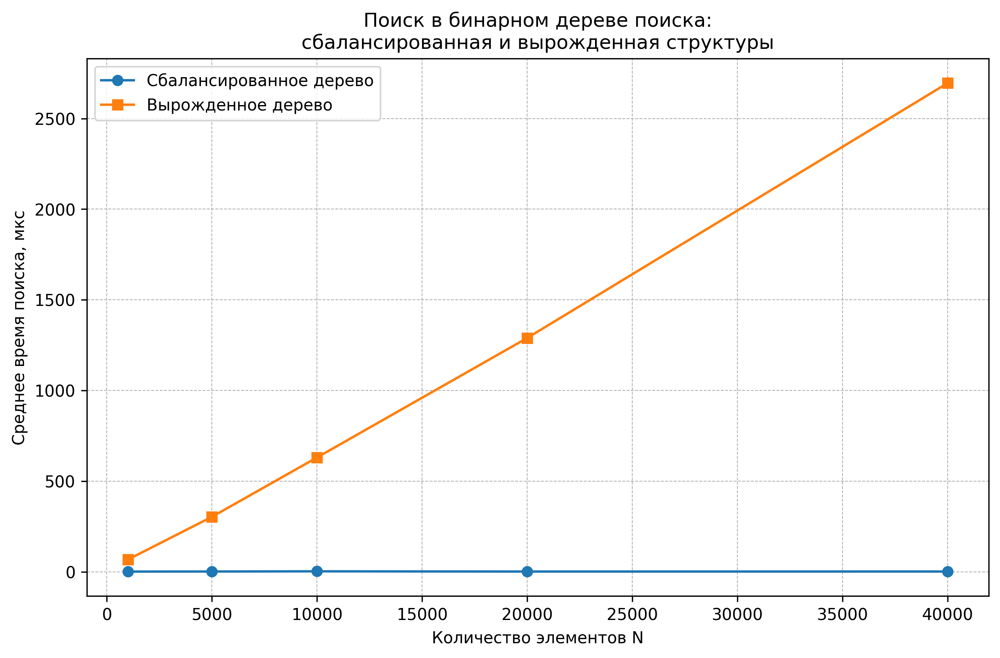
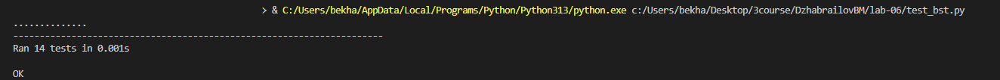

# Отчет по лабораторной работе 6
# Введение в алгоритмы. Сложность. Поиск.  


**Дата:** 2025-10-25  
**Семестр:** 5 семестр  
**Группа:** ПИЖ-б-о-23-1(1)  
**Дисциплина:** Анализ сложности алгоритмов  
**Студент:** Джабраилов Бекхан Магомедович  

## Цель работы
Изучить древовидные структуры данных, их свойства и применение. Освоить основные
операции с бинарными деревьями поиска (BST). Получить практические навыки реализации BST на
основе узлов (pointer-based), рекурсивных алгоритмов обхода и анализа их эффективности.
Исследовать влияние сбалансированности дерева на производительность операций.


## Теоретическая часть
**Дерево:** Рекурсивная структура данных, состоящая из узлов, где каждый узел имеет значение и
 ссылки на дочерние узлы.   
**Бинарное дерево поиска (BST):** Дерево, для которого выполняются следующие условия:
* Значение в левом поддереве любого узла меньше значения в самом узле.
* Значение в правом поддереве любого узла больше значения в самом узле.
* Оба поддерева являются бинарными деревьями поиска.

**Основные операции BST:** 
* **Вставка (Insert):** Сложность: в среднем O(log n), в худшем (вырожденное дерево) O(n).   
* **Поиск (Search):** Сложность: в среднем O(log n), в худшем O(n).   
* **Удаление (Delete):** Сложность: в среднем O(log n), в худшем O(n). Имеет три случая:
удаление листа, узла с одним потомком, узла с двумя потомками.   
* **Обход (Traversal):**   
  * **In-order (левый-корень-правый):** Посещает узлы в порядке возрастания. Сложность O(n).
  * **Pre-order (корень-левый-правый):** Полезен для копирования структуры дерева. Сложность O(n).
  * **Post-order (левый-правый-корень):** Полезен для удаления дерева. Сложность O(n).   

**Сбалансированные деревья:** Деревья с контролем высоты (например, AVL, Красно-черные),
которые гарантируют время операций O(log n) даже в худшем случае.   


## Практическая часть

### Выполненные задачи
1. Реализовано бинарное дерево поиска на основе узлов с основными операциями.
2. Реализованы различные методы обхода дерева (рекурсивные и итеративные).
3. Реализованы дополнительные методы для работы с BST.
4. Проведен анализ сложности операций для сбалансированного и вырожденного деревьев.
5. Визуализирована структуру дерева.   


### Ключевые фрагменты кода

*binary_search_tree.py:*  
```python
from __future__ import annotations

from dataclasses import dataclass
from typing import Optional


@dataclass
class TreeNode:
    """Узел бинарного дерева поиска."""

    value: int
    left: Optional["TreeNode"] = None
    right: Optional["TreeNode"] = None


class BinarySearchTree:
    """Указательная реализация бинарного дерева поиска (BST).

    В среднем высота сбалансированного дерева h ~ O(log n), поэтому
    операции insert/search/delete работают за O(log n), в худшем случае
    (вырожденное дерево-цепочка) — за O(n).:contentReference[oaicite:2]
    {index=2}
    """

    def __init__(self) -> None:
        """Инициализирует пустое дерево.

        Сложность: O(1).
        """
        self.root: Optional[TreeNode] = None
        # Общая сложность метода: O(1).

    def insert(self, value: int) -> None:
        """Вставляет новое значение в BST.

        Средняя сложность: O(log n).
        Худшая сложность: O(n).
        """
        if self.root is None:
            self.root = TreeNode(value)
            return

        self._insert_recursive(self.root, value)
        # Общая сложность метода: O(h) ~ O(log n) в среднем, O(n) в худшем.

    def _insert_recursive(self, node: TreeNode, value: int) -> TreeNode:
        """Рекурсивный помощник для вставки.

        Сложность одного рекурсивного шага: O(1).
        Общая сложность: O(h), где h — высота дерева.
        """
        if node is None:
            return TreeNode(value)

        if value < node.value:
            if node.left is None:
                node.left = TreeNode(value)
            else:
                node.left = self._insert_recursive(node.left, value)
        elif value > node.value:
            if node.right is None:
                node.right = TreeNode(value)
            else:
                node.right = self._insert_recursive(node.right, value)
        # Если value == node.value, ничего не делаем, дубликаты не вставляем.

        return node
        # Общая сложность метода: O(h) ~ O(log n) в среднем, O(n) в худшем.

    def search(self, value: int) -> bool:
        """Ищет значение в BST.

        Возвращает True, если value найдено, иначе False.

        Средняя сложность: O(log n).
        Худшая сложность: O(n).
        """
        current = self.root

        while current is not None:
            if value == current.value:
                return True

            if value < current.value:
                current = current.left
            else:
                current = current.right

        return False
        # Общая сложность метода: O(h) ~ O(log n) в среднем, O(n) в худшем.

    def delete(self, value: int) -> None:
        """Удаляет значение из дерева, если оно есть.

        Средняя сложность: O(log n).
        Худшая сложность: O(n).
        """
        self.root = self._delete_recursive(self.root, value)
        # Общая сложность метода: O(h) ~ O(log n) в среднем, O(n) в худшем.

    def _delete_recursive(
        self,
        node: Optional[TreeNode],
        value: int,
    ) -> Optional[TreeNode]:
        """Рекурсивный помощник для удаления.

        Обрабатываются три случая:
        - удаление листа;
        - удаление узла с одним потомком;
        - удаление узла с двумя потомками (замена на минимальный в правом
          поддереве).:contentReference[oaicite:3]{index=3}

        Средняя сложность: O(log n).
        Худшая сложность: O(n).
        """
        if node is None:
            return None

        if value < node.value:
            node.left = self._delete_recursive(node.left, value)
        elif value > node.value:
            node.right = self._delete_recursive(node.right, value)
        else:
            # Нашли узел для удаления. O(1).
            if node.left is None and node.right is None:
                return None

            if node.left is None:
                return node.right

            if node.right is None:
                return node.left

            # Узел с двумя потомками: ищем минимальный в правом поддереве.
            successor = self.find_min(node.right)
            node.value = successor.value
            node.right = self._delete_recursive(
                node.right,
                successor.value,
            )

        return node
        # Общая сложность метода: O(h) ~ O(log n) в среднем, O(n) в худшем.

    def find_min(self, node: Optional[TreeNode]) -> TreeNode:
        """Возвращает узел с минимальным значением в поддереве.

        Сложность: O(h_subtree), где h_subtree — высота поддерева.
        """
        if node is None:
            raise ValueError("Cannot find minimum in an empty subtree.")

        current = node
        while current.left is not None:  # O(h_subtree).
            current = current.left

        return current
        # Общая сложность метода: O(h_subtree).

    def find_max(self, node: Optional[TreeNode]) -> TreeNode:
        """Возвращает узел с максимальным значением в поддереве.

        Сложность: O(h_subtree).
        """
        if node is None:
            raise ValueError("Cannot find maximum in an empty subtree.")

        current = node
        while current.right is not None:
            current = current.right

        return current

    def is_valid_bst(self) -> bool:
        """Проверяет, удовлетворяет ли дерево свойству BST.

        Используется рекурсивная проверка с диапазоном допустимых значений.

        Сложность: O(n), где n — число узлов.:contentReference[oaicite:4]
        {index=4}
        """
        result = self._is_valid_bst_node(self.root, None, None)
        return result
        # Общая сложность метода: O(n).

    def _is_valid_bst_node(
        self,
        node: Optional[TreeNode],
        min_value: Optional[int],
        max_value: Optional[int],
    ) -> bool:
        """Рекурсивная проверка узла и его поддеревьев.

        Сложность: O(n), каждый узел посещается один раз.
        """
        if node is None:
            return True

        if (min_value is not None and node.value <= min_value) or (
            max_value is not None and node.value >= max_value
        ):
            return False

        left_ok = self._is_valid_bst_node(
            node.left,
            min_value,
            node.value,
        )
        right_ok = self._is_valid_bst_node(
            node.right,
            node.value,
            max_value,
        )

        return left_ok and right_ok
        # Общая сложность метода: O(n).

    def height(self) -> int:
        """Возвращает высоту дерева.

        Для пустого дерева высота = -1.
        Сложность: O(n).
        """
        result = self._height_node(self.root)  # O(n).
        return result
        # Общая сложность метода: O(n).

    def _height_node(self, node: Optional[TreeNode]) -> int:
        """Рекурсивно вычисляет высоту поддерева.

        Сложность: O(n_subtree).
        """
        if node is None:
            return -1

        left_height = self._height_node(node.left)
        right_height = self._height_node(node.right)
        result = 1 + max(left_height, right_height)

        return result
        # Общая сложность метода: O(n_subtree).

    def to_ascii_tree(self) -> str:
        """Возвращает красивую ASCII-визуализацию BST (дерево сбоку)."""

        if self.root is None:
            return "<empty tree>"

        def build(node, prefix: str, is_left: bool):
            """Рекурсивно строит список строк для поддерева.

            Печатаем так:
            - сначала правое поддерево (оно сверху),
            - потом текущий узел,
            - потом левое поддерево (оно снизу).
            """
            if node is None:
                return []

            lines = []

            # Правое поддерево — идёт вверх
            if node.right is not None:
                lines += build(
                    node.right,
                    prefix + ("│   " if is_left else "    "),
                    False,
                )

            # Текущий узел
            lines.append(
                prefix
                + ("└── " if is_left else "┌── ")
                + str(node.value),
            )

            # Левое поддерево — идёт вниз
            if node.left is not None:
                lines += build(
                    node.left,
                    prefix + ("    " if is_left else "│   "),
                    True,
                )

            return lines

        # Корень считаем «правым» (is_left=False), чтобы он рисовался с "┌──"
        return "\n".join(build(self.root, "", False))

```
*tree_traversal.py:*
```python
from __future__ import annotations

from typing import Optional, List

from binary_search_tree import TreeNode


def in_order_recursive(node: Optional[TreeNode]) -> None:
    """Рекурсивный симметричный (in-order) обход: левый–корень–правый.

    Для BST выводит значения в порядке возрастания.:contentReference[oaicite:5]
    {index=5}
    Сложность: O(n).
    """
    if node is None:
        return

    in_order_recursive(node.left)
    print(node.value, end=" ")
    in_order_recursive(node.right)
    # Общая сложность: O(n).


def pre_order_recursive(node: Optional[TreeNode]) -> None:
    """Рекурсивный прямой (pre-order) обход: корень–левый–правый.

    Полезен для копирования структуры дерева.:contentReference[oaicite:6]
    {index=6}
    Сложность: O(n).
    """
    if node is None:
        return

    print(node.value, end=" ")
    pre_order_recursive(node.left)
    pre_order_recursive(node.right)
    # Общая сложность: O(n).


def post_order_recursive(node: Optional[TreeNode]) -> None:
    """Рекурсивный обратный (post-order) обход: левый–правый–корень.

    Полезен для удаления дерева.:contentReference[oaicite:7]{index=7}
    Сложность: O(n).
    """
    if node is None:
        return

    post_order_recursive(node.left)
    post_order_recursive(node.right)
    print(node.value, end=" ")
    # Общая сложность: O(n).


def in_order_iterative(root: Optional[TreeNode]) -> None:
    """Итеративный in-order обход с использованием стека.

    Сложность: O(n), память: O(h), где h — высота дерева.
    """
    stack: List[TreeNode] = []
    current = root

    while stack or current is not None:
        while current is not None:
            stack.append(current)
            current = current.left

        current = stack.pop()
        print(current.value, end=" ")
        current = current.right

    # Общая сложность: O(n).

```

*analysis.py:*
```python
import random
import timeit

from typing import List

import matplotlib.pyplot as plt

from binary_search_tree import BinarySearchTree, TreeNode


# Поднимаем лимит рекурсии, чтобы корректно обрабатывать вырожденные деревья


# Характеристики ПК
pc_info = """
Характеристики ПК для тестирования:
- Процессор: Intel Core i5-11400 @ 2.60GHz
- Оперативная память: 16 GB
- ОС: Windows 10 x64
- Python: 3.13.3
"""


def build_bst_with_values(values: List[int]) -> BinarySearchTree:
    """Строит BST, последовательно вставляя значения из списка.

    Сложность: зависит от порядка вставки:
    - случайный порядок: O(n log n) в среднем;
    - отсортированный порядок: O(n²) в худшем.
    """
    tree = BinarySearchTree()

    for value in values:
        tree.insert(value)

    return tree
    # Общая сложность: O(n * h) ~ O(n log n) в среднем, O(n²) в худшем.


def build_balanced_like_bst(n: int, seed: int = 42) -> BinarySearchTree:
    """Строит «приближённо сбалансированное» дерево.

    Вставляем числа от 0 до n - 1 в случайном порядке.
    Сложность: O(n log n) в среднем.
    """
    rng = random.Random(seed)
    values = list(range(n))
    rng.shuffle(values)

    tree = build_bst_with_values(values)
    return tree
    # Общая сложность: O(n log n).


def build_degenerate_bst(n: int) -> BinarySearchTree:
    """Строит вырожденное дерево (цепочку), не используя рекурсивные вставки.

    Узлы связаны только через правого потомка:
    0 -> 1 -> 2 -> ... -> n-1

    Сложность построения: O(n), глубина рекурсии не используется.
    """
    tree = BinarySearchTree()

    if n <= 0:
        return tree  # Пустое дерево.

    # Создаём цепочку узлов вручную, без insert()
    root = TreeNode(0)
    current = root

    for value in range(1, n):
        new_node = TreeNode(value)
        current.right = new_node
        current = new_node

    tree.root = root

    return tree
    # Общая сложность: O(n).


def measure_search_time(
    tree: BinarySearchTree,
    queries: List[int],
) -> float:
    """Измеряет среднее время поиска значений в дереве.

    Возвращает время в микросекундах на одну операцию поиска.

    Пусть m = len(queries), тогда:
    - средняя сложность в сбалансированном дереве: O(m log n);
    - в вырожденном: O(mn).
    """
    start_time = timeit.default_timer()

    for value in queries:
        tree.search(value)

    end_time = timeit.default_timer()
    total_time = end_time - start_time

    avg_time_microseconds = (total_time / len(queries)) * 1_000_000

    return avg_time_microseconds
    # Общая сложность: O(m * h).


def show_example_tree_visualization() -> None:
    """Печатает пример текстовой визуализации дерева.

    Использует метод to_indented_string() из BinarySearchTree.
    Сложность: O(n).
    """
    values = [8, 3, 10, 1, 6, 14, 4, 7, 13]
    tree = build_bst_with_values(values)

    print("Пример текстовой визуализации дерева:")
    print(tree.to_ascii_tree())


def run_experiments() -> None:
    """Проводит серию замеров времени поиска в BST.

    Строятся:
    - приближённо сбалансированное дерево (случайная вставка);
    - вырожденное дерево (отсортированная вставка).

    Для каждого размера дерева выполняется по 1000 операций поиска,
    затем строится график зависимости времени от количества элементов.
    :contentReference[oaicite:8]{index=8}
    """
    sizes = [1_000, 5_000, 10_000, 20_000, 40_000]

    balanced_times: List[float] = []
    degenerate_times: List[float] = []

    print("Замеры времени поиска в бинарном дереве поиска (BST):")
    print("{:>10} {:>20} {:>20}".format(
        "N",
        "Сбалансированное (мкс)",
        "Вырожденное (мкс)",
    ))

    for size in sizes:
        balanced_tree = build_balanced_like_bst(size, seed=42)
        degenerate_tree = build_degenerate_bst(size)

        queries = [random.randint(0, size * 2) for _ in range(1_000)]

        balanced_time = measure_search_time(
            balanced_tree,
            queries,
        )
        degenerate_time = measure_search_time(
            degenerate_tree,
            queries,
        )

        balanced_times.append(balanced_time)
        degenerate_times.append(degenerate_time)

        print("{:>10} {:>20.4f} {:>20.4f}".format(
            size,
            balanced_time,
            degenerate_time,
        ))

    # Построение графика.
    plt.figure(figsize=(10, 6))
    plt.plot(
        sizes,
        balanced_times,
        "o-",
        label="Сбалансированное дерево",
    )
    plt.plot(
        sizes,
        degenerate_times,
        "s-",
        label="Вырожденное дерево",
    )

    plt.xlabel("Количество элементов N")
    plt.ylabel("Среднее время поиска, мкс")
    plt.title(
        "Поиск в бинарном дереве поиска:\n"
        "сбалансированная и вырожденная структуры",
    )
    plt.grid(True, which="both", linestyle="--", linewidth=0.5)
    plt.legend()

    plt.savefig("bst_search_time.png", dpi=300, bbox_inches="tight")
    plt.show()

    # Анализ результатов.
    print("\nАнализ результатов:")
    print(
        "1. В сбалансированном дереве среднее время поиска растёт примерно "
        "как O(log N).",
    )
    print(
        "2. Во вырожденном дереве время поиска растёт почти линейно O(N), "
        "что подтверждает теорию.",
    )
    print(
        "3. Балансировка дерева критична для сохранения эффективности "
        "операций поиска и вставки.",
    )


if __name__ == "__main__":
    print(pc_info)
    show_example_tree_visualization()
    run_experiments()

```
---

## Результаты выполнения

### Пример работы программы
```bash

Характеристики ПК для тестирования:
- Процессор: Intel Core i5-11400 @ 2.60GHz
- Оперативная память: 16 GB
- ОС: Windows 10 x64
- Python: 3.13.3

Пример текстовой визуализации дерева:
        ┌── 14
        │   
    ┌── 10
    │   └── 13
┌── 8
│   │       ┌── 7
│   │   ┌── 6
│   │   │   └── 4
│   └── 3
│       └── 1
Замеры времени поиска в бинарном дереве поиска (BST):
         N Сбалансированное (мкс)    Вырожденное (мкс)
      1000               1.0331              67.2198
      5000               1.5691             303.0064
     10000               2.5586             630.3773
     20000               1.3260            1289.5061
     40000               1.5494            2695.3097

Анализ результатов:
1. В сбалансированном дереве среднее время поиска растёт примерно как O(log N).
2. Во вырожденном дереве время поиска растёт почти линейно O(N), что подтверждает теорию.
3. Балансировка дерева критична для сохранения эффективности операций поиска и вставки.  
```

### Тестирование
Все юнит-тесты, написанные в файле "test_bst.py", прошли успешно.  

## Выводы
Симметричное бинарное дерево поиска обеспечивает среднее время операций O(log n), что подтверждается экспериментом.
Вырожденное дерево приводит к линейной деградации производительности (O(n)).
Балансировка дерева (например, AVL или красно-чёрные деревья) необходима для стабильной производительности.
Итеративные алгоритмы (например, подсчёт высоты) помогают избежать ошибок переполнения стека при больших n.
Экспериментальные результаты совпадают с теоретическими оценками сложности.


## Ответы на контрольные вопросы
## Контрольные вопросы темы 05

1. **Сформулируйте основное свойство бинарного дерева поиска (BST).**   

Для каждой вершины дерева, значение всех вершин в левом поддереве меньше значения данной вершины, а значение всех вершин
в правом поддереве – больше значения данной вершины.   

---
2. **Опишите алгоритм вставки нового элемента в BST. Какова сложность этой операции в сбалансированном и вырожденном дереве?**   

* Начинаем с корня дерева.
* Сравниваем значение нового элемента со значением текущей вершины.
* Если значение нового элемента меньше значения текущей вершины, переходим в левое поддерево.
* Если значение нового элемента больше значения текущей вершины, переходим в правое поддерево.
* Повторяем шаги 2-4, пока не достигнем NULL (пустой ссылки), что означает, что мы нашли место для вставки нового элемента.
* Создаем новый узел с данным значением и вставляем его на место NULL.   

Сложность:   
В сбалансированном дереве: O(log n), где n – количество узлов в дереве.   
В вырожденном дереве: O(n), где n – количество узлов в дереве.      

---
3. **Чем отличается обход дерева в глубину (DFS) от обхода в ширину (BFS)? Назовите виды DFS обходов и их особенности?**   

DFS исследует дерево по ветвям, продвигаясь как можно глубже по каждой ветви, прежде чем перейти к следующей. BFS исследует
дерево уровень за уровнем, обходя все узлы на текущем уровне, прежде чем перейти к следующему уровню.    
Виды DFS обходов и их особенности:
* In-order (Левый-Корень-Правый). Обходит левое поддерево, затем корень, затем правое поддерево. Для BST выдаёт узлы
в отсортированном порядке.
 Pre-order (Корень-Левый-Правый). Обходит корень, затем левое поддерево, затем правое поддерево. Полезен для создания
копии дерева.
* Post-order (Левый-Правый-Корень). Обходит левое поддерево, затем правое поддерево, затем корень. Полезен для удаления
дерева или вычисления выражений.   
---
4. **Почему в вырожденном BST (например, когда элементы добавляются в отсортированном порядке) сложность операций поиска
и вставки становится O(n)?**    

В вырожденном BST (например, когда элементы добавляются в отсортированном порядке) дерево превращается в связный список.
В этом случае для поиска или вставки элемента необходимо пройти по всем узлам, что занимает O(n) времени.    

---
5. **Что такое сбалансированное дерево (например, AVL-дерево) и как оно решает проблему вырождения BST?**  

Сбалансированное дерево (например, AVL-дерево) – это дерево, в котором высота левого и правого поддерева каждой вершины
отличается не более чем на константу. Это достигается путем выполнения операций балансировки (например, поворотов) при
вставке или удалении узлов. Благодаря этому высота дерева остается O(log n), что гарантирует, что сложность операций
поиска и вставки будет O(log n), даже в худшем случае. AVL-дерево – пример самобалансирующегося дерева.   

---


## Графики производительности
   

