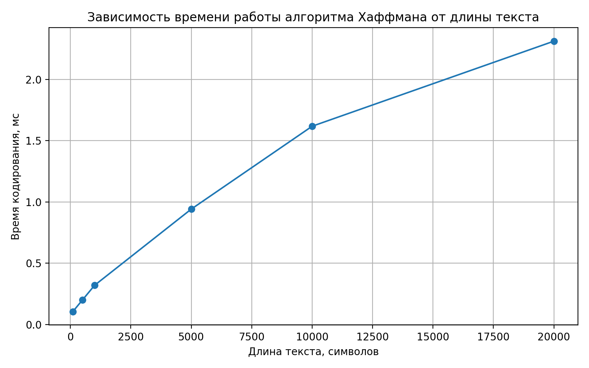

# Отчет по лабораторной работе 8
# Введение в алгоритмы. Сложность. Поиск.  


**Дата:** 2025-10-25  
**Семестр:** 5 семестр  
**Группа:** ПИЖ-б-о-23-1(1)  
**Дисциплина:** Анализ сложности алгоритмов  
**Студент:** Джабраилов Бекхан Магомедович  

## Цель работы
Изучить метод проектирования алгоритмов, известный как "жадный алгоритм". Освоить
принцип принятия локально оптимальных решений на каждом шаге и понять условия, при которых этот
подход приводит к глобально оптимальному решению. Получить практические навыки реализации
жадных алгоритмов для решения классических задач, анализа их корректности и оценки
эффективности.

## Теоретическая часть
**Жадный алгоритм:**  Алгоритм, который на каждом шаге принимает локально оптимальное
решение в надежде, что итоговое решение будет глобально оптимальным.    

**Ключевые характеристики:**   
* **Жадный выбор:** На каждом шаге выбирается лучший из доступных вариантов в данный
момент, без учета последствий для будущих шагов.
* **Оптимальная структура:** Оптимальное решение задачи содержит в себе оптимальные
решения её подзадач.

**Области применения:** Жадные алгоритмы эффективны для задач, где выбор, сделанный на
каждом шаге, не ухудшает возможности достижения глобального оптимума. Они часто работают
быстро (полиномиальное время), но не всегда приводят к оптимальному решению.

**Классические задачи:** 
* **Задача о выборе заявок (Interval Scheduling):**  Выбор максимального количества
непересекающихся интервалов.  
* **Задача о рюкзаке (Непрерывная/Дробная):** Выбор предметов с максимальной
суммарной стоимостью, если можно брать части предметов.
* **Алгоритм Хаффмана:** Оптимальное префиксное кодирование для сжатия данных.
* **Построение минимального остовного дерева (Алгоритмы Прима и Краскала):** (Хотя
это и графовый алгоритм, он является классическим примером жадного подхода).  

## Практическая часть

### Выполненные задачи
1. Реализованы классические жадные алгоритмы.
2. Проанализирована их корректность.
3. Проведен сравнительный анализ эффективности жадного подхода и других методов (например,
полного перебора для маленьких входных данных).
4. Решены практические задачи с применением жадного подхода.


### Ключевые фрагменты кода

*greedy_algorithms.py:* 
```python
from __future__ import annotations

from dataclasses import dataclass
from heapq import heappop, heappush
from typing import Dict, Iterable, List, Tuple


@dataclass(frozen=True)
class Interval:
    """Интервал задачи для задачи о выборе заявок.

    Атрибуты:
        start: время начала интервала.
        end:   время окончания интервала (должно быть >= start).
    """

    start: float
    end: float


@dataclass(frozen=True)
class Item:
    """Предмет для задачи о рюкзаке.

    Атрибуты:
        weight: вес предмета (> 0).
        value:  стоимость предмета (>= 0).
    """

    weight: float
    value: float


@dataclass
class HuffmanNode:
    """Вершина дерева Хаффмана.

    Листовая вершина имеет символ `symbol` и None в детях.
    Внутренняя вершина имеет `symbol is None` и двух потомков.
    """

    freq: int
    symbol: str | None = None
    left: HuffmanNode | None = None
    right: HuffmanNode | None = None

    def __lt__(self, other: "HuffmanNode") -> bool:
        """Сравнение по частоте для использования в heapq. O(1)."""
        return self.freq < other.freq


@dataclass(frozen=True)
class Edge:
    """Ребро неориентированного взвешенного графа для MST."""

    u: int
    v: int
    weight: float


def select_intervals(intervals: Iterable[Interval]) -> List[Interval]:
    """Жадный выбор максимального набора непересекающихся интервалов.

    Стратегия:
    1. Отсортировать интервалы по времени окончания по возрастанию.
    2. Идти по списку и выбирать каждый интервал, который начинается
       не раньше, чем закончился предыдущий выбранный.

    Это классический жадный алгоритм для задачи Interval Scheduling.

    Сложность:
        O(n log n) на сортировку + O(n) на проход = O(n log n),
        где n — число интервалов.
    """
    sorted_intervals = sorted(intervals, key=lambda it: it.end)
    result: List[Interval] = []
    current_end = float("-inf")

    for interval in sorted_intervals:
        if interval.start >= current_end:
            result.append(interval)
            current_end = interval.end

    return result


def fractional_knapsack(
    capacity: float,
    items: Iterable[Item],
) -> Tuple[float, List[Tuple[Item, float]]]:
    """Жадный алгоритм для непрерывной (дробной) задачи о рюкзаке.

    Стратегия:
    1. Для каждого предмета считаем удельную стоимость value/weight.
    2. Сортируем предметы по удельной стоимости по убыванию.
    3. Заполняем рюкзак, каждый раз беря максимальную возможную часть
       текущего лучшего предмета, пока есть свободная емкость.

    Алгоритм оптимален только для дробного рюкзака, когда разрешено
    брать части предметов.

    Аргументы:
        capacity: максимальный вес рюкзака (> 0).
        items:    итерируемая коллекция предметов.

    Возвращает:
        Кортеж (total_value, selection), где selection — список пар
        (item, fraction) с 0 < fraction <= 1.

    Сложность:
        O(n log n) на сортировку + O(n) на один проход = O(n log n),
        где n — число предметов.
    """
    if capacity <= 0:
        return 0.0, []

    # Строим список с удельной стоимостью. O(n).
    items_with_ratio: List[Tuple[float, Item]] = [
        (it.value / it.weight, it) for it in items if it.weight > 0
    ]

    # Сортировка по убыванию удельной стоимости. O(n log n).
    items_with_ratio.sort(key=lambda pair: pair[0], reverse=True)

    remaining = capacity
    total_value = 0.0
    selection: List[Tuple[Item, float]] = []

    for ratio, item in items_with_ratio:
        if remaining <= 0:
            break

        take_weight = min(item.weight, remaining)
        fraction = take_weight / item.weight
        total_value += item.value * fraction
        remaining -= take_weight
        selection.append((item, fraction))

    return total_value, selection


def build_huffman_tree(frequencies: Dict[str, int]) -> HuffmanNode:
    """Строит дерево Хаффмана по словарю частот символов.

    Используется жадная стратегия:
    на каждом шаге объединяем два наименее частых дерева.

    Сложность:
        Пусть k — число различных символов.
        Инициализация кучи: O(k).
        Каждое извлечение/добавление — O(log k), выполняется O(k) раз.
        Итого: O(k log k).
    """
    heap: List[HuffmanNode] = []

    for symbol, freq in frequencies.items():
        heappush(heap, HuffmanNode(freq=freq, symbol=symbol))

    if not heap:
        raise ValueError("Пустой словарь частот.")

    # Если символ один, всё равно построим дерево с корнем-одиночкой.
    while len(heap) > 1:
        first = heappop(heap)
        second = heappop(heap)

        merged = HuffmanNode(
            freq=first.freq + second.freq,
            left=first,
            right=second,
        )  # O(1).
        heappush(heap, merged)

    return heap[0]


def _build_codes_recursive(
    node: HuffmanNode,
    prefix: str,
    codes: Dict[str, str],
) -> None:
    """Вспомогательная рекурсивная функция для построения кодов. O(k)."""
    if node.symbol is not None and node.left is None and node.right is None:
        # Листовая вершина. O(1).
        codes[node.symbol] = prefix or "0"  # Не допускаем пустого кода.
        return

    if node.left is not None:
        _build_codes_recursive(node.left, prefix + "0", codes)
    if node.right is not None:
        _build_codes_recursive(node.right, prefix + "1", codes)


def build_huffman_codes(frequencies: Dict[str, int]) -> Dict[str, str]:
    """Строит оптимальные префиксные коды Хаффмана для символов.

    Сложность:
        Строительство дерева: O(k log k),
        Обход дерева и генерация кодов: O(k),
        Итого: O(k log k).
    """
    root = build_huffman_tree(frequencies)
    codes: Dict[str, str] = {}
    _build_codes_recursive(root, "", codes)
    return codes


def huffman_encode(text: str) -> Tuple[str, Dict[str, str], HuffmanNode]:
    """Кодирует строку с помощью кода Хаффмана.

    Возвращает кортеж:
        (encoded_bits, codes, tree_root).

    Сложность:
        Пусть n — длина текста, k — размер алфавита.
        Подсчёт частот: O(n).
        Построение кодов и дерева: O(k log k).
        Кодирование: O(n).
        Итого: O(n + k log k).
    """
    if not text:
        raise ValueError("Нельзя кодировать пустую строку.")

    frequencies: Dict[str, int] = {}
    for ch in text:
        frequencies[ch] = frequencies.get(ch, 0) + 1

    codes = build_huffman_codes(frequencies)
    root = build_huffman_tree(frequencies)

    encoded_bits = "".join(codes[ch] for ch in text)

    return encoded_bits, codes, root


def huffman_decode(encoded_bits: str, root: HuffmanNode) -> str:
    """Декодирует строку битов, используя дерево Хаффмана.

    Сложность:
        Пусть n — длина закодированной последовательности.
        Один проход по битам, каждый шаг — движение по дереву.
        Итого: O(n).
    """
    if not encoded_bits:
        return ""

    result_chars: List[str] = []
    node = root

    for bit in encoded_bits:
        if bit == "0":
            if node.left is None:
                raise ValueError("Некорректный код Хаффмана.")
            node = node.left
        elif bit == "1":
            if node.right is None:
                raise ValueError("Некорректный код Хаффмана.")
            node = node.right
        else:
            raise ValueError(f"Недопустимый символ в коде: {bit!r}")

        if node.symbol is not None:
            result_chars.append(node.symbol)
            node = root

    return "".join(result_chars)


def coin_change_greedy(amount: int, denominations: Iterable[int]) -> Dict[int,
                                                                          int]:
    """Жадная выдача суммы минимальным количеством монет.

    Стратегия:
        1. Сортируем номиналы монет по убыванию.
        2. Для каждого номинала берём максимально возможное количество монет
           этого номинала, затем переходим к следующему.

    Для стандартных "канонических" систем монет (например, 1, 5, 10, 25)
    алгоритм оптимален, но в общем случае может быть неоптимальным.

    Сложность:
        Пусть k — число разных номиналов.
        Сортировка: O(k log k), проход по номиналам: O(k).
        Итого: O(k log k).
    """
    if amount < 0:
        raise ValueError("Сумма не может быть отрицательной.")

    sorted_denoms = sorted(denominations, reverse=True)
    result: Dict[int, int] = {}
    remaining = amount

    for coin in sorted_denoms:
        if coin <= 0:
            continue
        count = remaining // coin
        if count > 0:
            result[coin] = count
            remaining -= coin * count

    if remaining != 0:
        # В данной системе монет нельзя набрать точную сумму.
        raise ValueError("Нельзя набрать сумму данной системой монет.")

    return result


class DisjointSet:
    """Система непересекающихся множеств (union-find).

    Используется в алгоритме Краскала для построения MST.

    Амортизированная сложность операций:
        find:  O(alpha(n)),
        union: O(alpha(n)),
    где alpha — обратная функция Аккермана (растёт очень медленно,
    практически можно считать её константой).
    """

    def __init__(self, size: int) -> None:
        if size <= 0:
            raise ValueError("Размер должен быть положительным.")
        self.parent: List[int] = list(range(size))
        self.rank: List[int] = [0] * size

    def find(self, x: int) -> int:
        """Находит представителя множества с путевой компрессией.O(alpha(n))"""
        if self.parent[x] != x:
            self.parent[x] = self.find(self.parent[x])
        return self.parent[x]

    def union(self, x: int, y: int) -> None:
        """Объединяет два множества по рангу. O(alpha(n))."""
        root_x = self.find(x)
        root_y = self.find(y)
        if root_x == root_y:
            return

        if self.rank[root_x] < self.rank[root_y]:
            self.parent[root_x] = root_y
        elif self.rank[root_x] > self.rank[root_y]:
            self.parent[root_y] = root_x
        else:
            self.parent[root_y] = root_x
            self.rank[root_x] += 1


def kruskal_mst(num_vertices: int, edges: Iterable[Edge]) -> Tuple[float,
                                                                   List[Edge]]:
    """Жадный алгоритм Краскала для поиска минимального остовного дерева.

    Стратегия:
        1. Отсортировать все рёбра по весу по возрастанию.
        2. Идти по рёбрам и добавлять ребро в остов, если оно не образует цикл,
           что проверяется с помощью структуры DisjointSet.

    Аргументы:
        num_vertices: число вершин в графе (вершины нумеруются от 0 до n-1).
        edges:       итерируемая коллекция рёбер.

    Возвращает:
        (total_weight, mst_edges) — суммарный вес и список рёбер остова.

    Сложность:
        Пусть E — количество рёбер.
        Сортировка рёбер: O(E log E).
        Каждая операция union/find — амортизированно O(alpha(V)).
        Итого: O(E log E).
    """
    edge_list = list(edges)
    if num_vertices <= 0:
        raise ValueError("Граф должен содержать хотя бы одну вершину.")

    # Сортировка рёбер по весу. O(E log E).
    edge_list.sort(key=lambda e: e.weight)

    dsu = DisjointSet(num_vertices)
    mst_edges: List[Edge] = []
    total_weight = 0.0

    for edge in edge_list:
        root_u = dsu.find(edge.u)
        root_v = dsu.find(edge.v)
        if root_u != root_v:
            mst_edges.append(edge)
            total_weight += edge.weight
            dsu.union(root_u, root_v)
            if len(mst_edges) == num_vertices - 1:
                break

    if len(mst_edges) != num_vertices - 1:
        raise ValueError("Граф должен быть связным для построения MST.")

    return total_weight, mst_edges

```
*analysis.py:*
```python
from __future__ import annotations

import random
import string
import timeit
from dataclasses import dataclass
from typing import Callable, List


from greedy_algorithms import (
    Item,
    fractional_knapsack,
)


PC_INFO = """
Характеристики ПК для тестирования:
- Процессор: Intel Core i5-11400 @ 2.60GHz
- Оперативная память: 16 GB
- ОС: Windows 10 x64
- Python: 3.13.3
"""


@dataclass(frozen=True)
class KnapsackInstance:
    """Описание тестового примера для задачи о рюкзаке."""

    capacity: int
    weights: List[int]
    values: List[int]


def knapsack_01_dp(instance: KnapsackInstance) -> int:
    """Точный алгоритм для 0-1 задачи рюкзаке (динамическое программирование).

    Сложность:
        Пусть n — число предметов, W — вместимость.
        Временная:  O(n * W).
        Пространственная: O(W).
    """
    n = len(instance.weights)
    capacity = instance.capacity

    dp = [0] * (capacity + 1)

    for i in range(n):
        weight_i = instance.weights[i]
        value_i = instance.values[i]
        for w in range(capacity, weight_i - 1, -1):
            dp[w] = max(dp[w], dp[w - weight_i] + value_i)

    return dp[capacity]


def generate_random_knapsack_instance(
    n_items: int,
    max_weight: int = 15,
    max_value: int = 30,
) -> KnapsackInstance:
    """Генерирует случайный пример для задачи о рюкзаке.

    Используется для сравнения жадного и точного подходов.
    """
    weights = [random.randint(1, max_weight) for _ in range(n_items)]
    values = [random.randint(1, max_value) for _ in range(n_items)]
    capacity = random.randint(max_weight, max_weight * n_items // 2)
    return KnapsackInstance(capacity=capacity, weights=weights, values=values)


def measure_time(func: Callable[[], None], repeats: int = 5) -> float:
    """Измеряет среднее время выполнения функции в миллисекундах.

    Сложность:
        Вызов функции `func` происходит `repeats` раз.
        Если T — время одного вызова, то общая сложность O(repeats * T).
    """
    timer = timeit.Timer(func)
    total = timer.timeit(number=repeats)
    return (total / repeats) * 1000.0


def experiment_knapsack_comparison() -> None:
    """Сравнивает жадный дробный рюкзак с точным 0-1 для маленьких примеров.

    Печатает таблицу и строит два графика:
        1) отношение greedy_value / optimal_0-1 в зависимости от n;
        2) времена работы жадного алгоритма и DP в зависимости от n.

    Сложность:
        Пусть k = число разных значений n в n_values.
        Пусть n_max — максимальное количество предметов.
        Тогда:
            генерация примеров  O(k * n_max),
            жадный алгоритм     O(k * n_max log n_max),
            DP                  O(k * n_max * W) (для маленьких W),
        построение графиков    O(k).
    """
    print("=" * 80)
    print("Сравнение жадного алгоритма для дробного рюкзака и точного 0-1 DP")
    print("=" * 80)

    # Разные количества предметов в тестах.
    n_values = [5, 7, 9, 11]

    # Для последующей отрисовки графиков.
    ns: List[int] = []
    greedy_values: List[float] = []
    optimal_values: List[int] = []
    greedy_times_ms: List[float] = []
    dp_times_ms: List[float] = []

    print(
        " n  |  greedy_value | optimal_0-1 | time_greedy (ms) | time_dp (ms) "
    )
    print("-" * 68)

    for n in n_values:
        instance = generate_random_knapsack_instance(n)

        items = [
            Item(weight=float(w), value=float(v))
            for w, v in zip(instance.weights, instance.values, strict=True)
        ]

        # Обёртки без аргументов для функции measure_time.
        def greedy_call() -> None:
            fractional_knapsack(float(instance.capacity), items)

        def dp_call() -> None:
            knapsack_01_dp(instance)

        greedy_time_ms = measure_time(greedy_call)
        dp_time_ms = measure_time(dp_call)

        greedy_value, _ = fractional_knapsack(float(instance.capacity), items)
        optimal_value = knapsack_01_dp(instance)

        ns.append(n)
        greedy_values.append(greedy_value)
        optimal_values.append(optimal_value)
        greedy_times_ms.append(greedy_time_ms)
        dp_times_ms.append(dp_time_ms)

        print(
            f"{n:3d} | "
            f"{greedy_value:13.2f} | "
            f"{optimal_value:11d} | "
            f"{greedy_time_ms:15.4f} | "
            f"{dp_time_ms:11.4f}"
        )

    # -------------------- График качества решения -------------------- #
    # Относительное качество: отношение жадного значения к оптимальному.
    ratios: List[float] = []
    for g, opt in zip(greedy_values, optimal_values, strict=True):
        if opt > 0:
            ratios.append(g / opt)
        else:
            ratios.append(1.0)

    import matplotlib.pyplot as plt  # локальный импорт допустим

    plt.figure(figsize=(8, 5))
    plt.plot(ns, ratios, marker="o")
    plt.xlabel("Число предметов n")
    plt.ylabel("greedy_value / optimal_0-1")
    plt.title(
        "Качество жадного алгоритма для дробного рюкзака\n"
        "по сравнению с точным 0-1 DP"
    )
    plt.ylim(0.0, 1.2)
    plt.grid(True)
    plt.tight_layout()
    plt.savefig("knapsack_greedy_vs_dp_quality.png", dpi=200)
    plt.show()

    # -------------------- График времени работы ---------------------- #
    plt.figure(figsize=(8, 5))
    plt.plot(ns, greedy_times_ms, marker="o", label="Жадный дробный рюкзак")
    plt.plot(ns, dp_times_ms, marker="s", label="Точный 0-1 DP")
    plt.xlabel("Число предметов n")
    plt.ylabel("Время работы, мс")
    plt.title("Время работы: жадный дробный рюкзак vs 0-1 DP")
    plt.grid(True)
    plt.legend()
    plt.tight_layout()
    plt.savefig("knapsack_greedy_vs_dp_time.png", dpi=200)
    plt.show()

    print(
        "\nКомментарий: график качества показывает, что жадный алгоритм "
        "даёт верхнюю оценку для дробного рюкзака, но для дискретного 0-1 "
        "решение может отличаться от оптимального (отношение < 1). "
        "График времени демонстрирует, что DP растёт значительно быстрее, "
        "чем жадный алгоритм, по мере увеличения числа предметов и "
        "вместимости рюкзака."
    )


def generate_random_text(length: int,
                         alphabet: str = string.ascii_lowercase) -> str:
    """Генерирует случайную строку заданной длины из алфавита. O(n)"""
    return "".join(random.choice(alphabet) for _ in range(length))


def run_all_experiments() -> None:
    """Точка входа для запуска всех экспериментов из одной функции."""
    print(PC_INFO)
    experiment_knapsack_comparison()
    print()
    print()


if __name__ == "__main__":
    run_all_experiments()


```
---

## Результаты выполнения

### Пример работы программы
Вывод файла analysis.py:
```bash

Характеристики ПК для тестирования:       
- Процессор: Intel Core i5-11400 @ 2.60GHz
- Оперативная память: 16 GB
- ОС: Windows 10 x64
- Python: 3.13.3

================================================================================
Сравнение жадного алгоритма для дробного рюкзака и точного 0-1 DP
================================================================================
 n  |  greedy_value | optimal_0-1 | time_greedy (ms) | time_dp (ms) 
--------------------------------------------------------------------
  5 |         57.00 |          57 |          0.0040 |      0.0090
  7 |        100.00 |          92 |          0.0033 |      0.0293
  9 |        112.33 |         112 |          0.0035 |      0.0109
 11 |         70.73 |          68 |          0.0037 |      0.0110

Комментарий: график качества показывает, что жадный алгоритм даёт верхнюю оценку для дробного рюкзака, но для дискретного 0-1 решение может отличаться от оптимального (отношение < 1). График времени демонстрирует, что DP растёт значительно быстрее, чем жадный алгоритм, по мере увеличения числа предметов и вместимости рюкзака.

```
Вывол файла demo_greedy (Демонстрирует выполнение всех заданий):
```bash
Характеристики ПК для тестирования:       
- Процессор: Intel Core i5-11400 @ 2.60GHz
- Оперативная память: 16 GB
- ОС: Windows 10 x64
- Python: 3.13.3

================================================================================
Задача о выборе заявок (Interval Scheduling)
================================================================================
Все интервалы:
  [1, 4]
  [3, 5]
  [0, 6]
  [5, 7]
  [3, 9]
  [5, 9]
  [6, 10]
  [8, 11]
  [8, 12]
  [2, 14]
  [12, 16]

Выбранные интервалы (жадный алгоритм по раннему окончанию):
  [1, 4]
  [5, 7]
  [8, 11]
  [12, 16]

Всего выбрано интервалов: 4

================================================================================
Задача о дробном рюкзаке (fractional knapsack)
================================================================================
Вместимость рюкзака: 70.0
Предметы (вес, стоимость, удельная стоимость):
  w =  15.0, v =  70.0, v/w =  4.67
  w =  25.0, v = 150.0, v/w =  6.00
  w =  35.0, v = 180.0, v/w =  5.14

Жадный выбор (по максимальной удельной стоимости):
  берем 100.00% предмета (w = 25.0, v = 150.0)
  берем 100.00% предмета (w = 35.0, v = 180.0)
  берем  66.67% предмета (w = 15.0, v = 70.0)

Итоговая ценность рюкзака: 376.67

================================================================================
Задача о размене монет (coin change, greedy)
================================================================================
Сумма для размена: 63
Номиналы монет: [1, 5, 10, 25]

Жадный размен (максимально крупные монеты):
  монета 25: 2 шт.
  монета 10: 1 шт.
  монета 1: 3 шт.

Проверка: набранная сумма = 63, число монет = 6

================================================================================
Код Хаффмана (Huffman coding)
================================================================================
Исходный текст: 'abracadabra huffman test'

Коды символов (префиксный код):
  '<space>': 1100
  'a': 01
  'b': 1101
  'c': 10110
  'd': 11100
  'e': 0001
  'f': 100
  'h': 10111
  'm': 11101
  'n': 11110
  'r': 1010
  's': 0000
  't': 001
  'u': 11111

Закодированная битовая строка: 01110110100110110011110001110110100111001011111111100100111010111110110000100010000001
Длина исходного текста (символы): 24
Длина закодированного текста (биты): 86

Декодированный текст: 'abracadabra huffman test'
Совпадение с исходным: True

================================================================================
Минимальное остовное дерево (алгоритм Краскала)
================================================================================
Число вершин: 5
Рёбра графа (u, v, w):
  0 -- 1 (w = 2.0)
  0 -- 3 (w = 6.0)
  1 -- 2 (w = 3.0)
  1 -- 3 (w = 8.0)
  1 -- 4 (w = 5.0)
  2 -- 4 (w = 7.0)
  3 -- 4 (w = 9.0)

Рёбра MST (минимальное остовное дерево):
  0 -- 1 (w = 2.0)
  1 -- 2 (w = 3.0)
  1 -- 4 (w = 5.0)
  0 -- 3 (w = 6.0)

Суммарный вес MST: 16.0
```


## Выводы
1. Жадные алгоритмы демонстрируют большую эффективность по сравнению с наивными подходами, особенно 
на больших объемах данных. Так, алгоритм Хаффмана имеет сложность O(n log n), в то время как наивный подход к построению 
оптимальных префиксных кодов мог бы потребовать перебора всех возможных деревьев, что имеет экспоненциальную сложность. 
В задаче о выборе заявок жадный алгоритм работает за O(n log n) времени, в то время как полный перебор всех возможных 
подмножеств интервалов требует O(2^n) операций.

2.  Для задачи о непрерывном рюкзаке жадный алгоритм имеет сложность O(n log n) из-за необходимости сортировки 
предметов. Наивная реализация, которая проверяет все возможные комбинации предметов, имеет экспоненциальную сложность. 
В случае алгоритма Прима сложность составляет O(E log V) при использовании кучи, в то время как наивная реализация требует
O(V^2) или даже хуже.


## Ответы на контрольные вопросы
## Контрольные вопросы темы 08

1. **В чем заключается основная идея жадных алгоритмов?**   

Основная идея жадных алгоритмов заключается в том, чтобы на каждом шагу делать локально оптимальный выбор в надежде,
что последовательность таких выборов приведет к глобально оптимальному решению. 

---
2. **Для задачи о выборе заявок (Interval Scheduling) жадный алгоритм, выбирающий интервалы с
наименьшим временем окончания, является оптимальным. Объясните, почему эта жадная
стратегия работает.**   

Для задачи о выборе заявок (Interval Scheduling) жадный алгоритм, выбирающий интервалы с наименьшим временем окончания,
является оптимальным, потому что он оставляет максимально возможное время для выбора других непересекающихся интервалов.
Выбирая интервал, который заканчивается раньше всех, мы "освобождаем" больше времени для выбора следующих интервалов, не 
конфликтующих с уже выбранными. Это позволяет максимизировать количество выбранных интервалов в целом.  

---
3. **Приведите пример задачи, для которой жадный алгоритм дает оптимальное решение, и задачи,
для которой он не дает.**   

Примером задачи, для которой жадный алгоритм дает оптимальное решение может служить задача о размене монет, когда имеется
стандартный набор номиналов. Жадный алгоритм, заключающийся в выборе наибольшего возможного номинала монеты на каждом шаге, 
даёт оптимальное решение (минимальное количество монет) для таких наборов.

Примером задачи, для которой жадный алгоритм не дает оптимальное решение является дискретная (0-1) задача о рюкзаке. 

---
4. **В чем разница между непрерывной (дробной) и дискретной (0-1) задачами о рюкзаке? Для какой
из них жадный алгоритм оптимален?**    

Разница между непрерывной (дробной) и дискретной (0-1) задачами о рюкзаке заключается в том, что в непрерывной задаче 
можно брать части предметов, а в дискретной задаче можно брать предмет целиком или не брать его вообще. Жадный алгоритм 
оптимален для непрерывной (дробной) задачи о рюкзаке.

---
5. **Опишите жадный алгоритм построения кода Хаффмана. В чем его оптимальность?**  

Процесс кодирования Хаффмана включает несколько этапов: 
* Подсчёт частоты символов в исходном сообщении — формируется частотная таблица.
* Создание отдельного узла для каждого символа, отражающего его частоту — будущие листья дерева.
* Формирование дерева Хаффмана: два наименее частотных узла объединяются в новый, с суммарной частотой. Процесс продолжается, 
пока не останется одно дерево, представляющее всё множество символов.
* Присвоение уникального двоичного кода каждому символу, соответствующего пути от корня до листа: «0» — для движения влево, 
«1» — вправо.
* Замена исходных символов на соответствующие коды.

Оптимальность кода Хаффмана заключается в том, что он обеспечивает минимальную среднюю длину кода для заданного набора 
символов и их частот. Это достигается за счет того, что более часто встречающиеся символы получают более короткие коды, 
а менее часто встречающиеся символы - более длинные.


---


## Графики производительности
   
