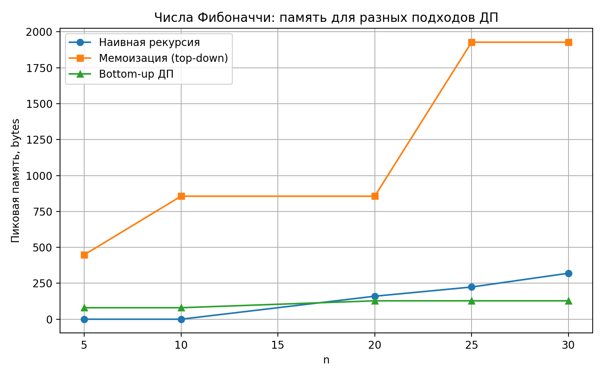
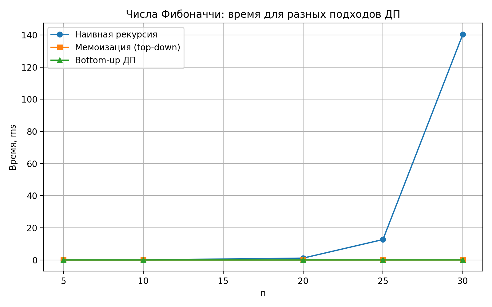
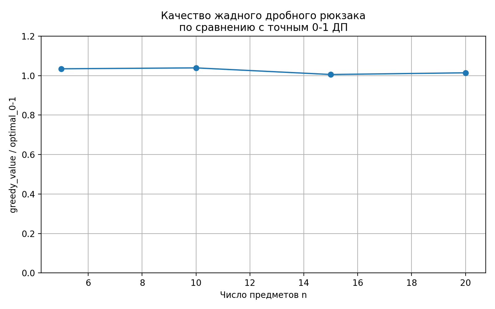
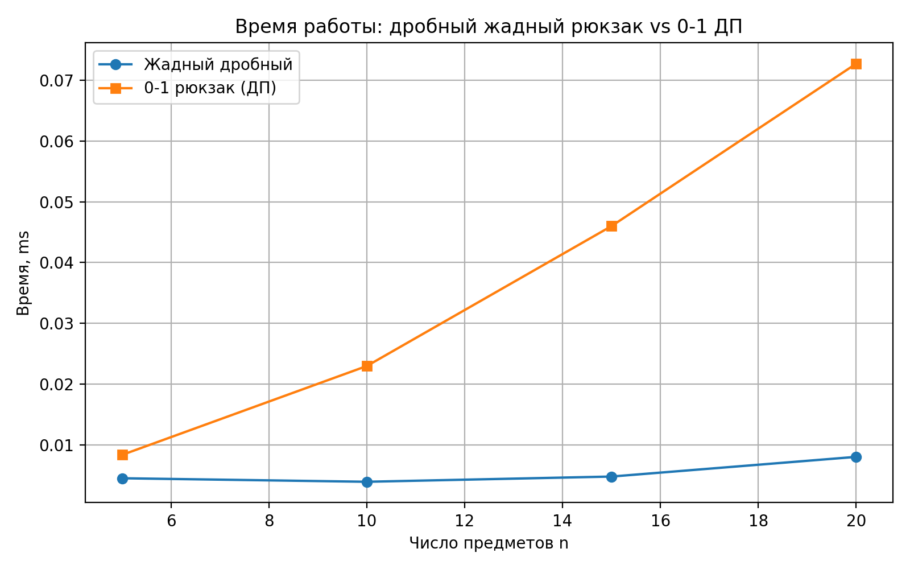

# Отчет по лабораторной работе 9
# Введение в алгоритмы. Сложность. Поиск.  


**Дата:** 2025-10-25  
**Семестр:** 5 семестр  
**Группа:** ПИЖ-б-о-23-1(1)  
**Дисциплина:** Анализ сложности алгоритмов  
**Студент:** Джабраилов Бекхан Магомедович  

## Цель работы
**Динамическое программирование (ДП):** Метод решения задач, в которых оптимальное
решение всей задачи зависит от оптимальных решений её перекрывающихся подзадач.    

**Ключевые принципы:**   
* **Оптимальная подструктура:** Оптимальное решение задачи может быть построено из
оптимальных решений её подзадач.
* **Перекрывающиеся подзадачи:** Подзадачи, решения которых используются многократно,
а не один раз.

**Подходы к реализации:**   
* **Нисходящее ДП (Top-Down, с мемоизацией):** Рекурсивное решение с сохранением
(кэшированием) результатов решения подзадач для повторных вычислений.
* **Восходящее ДП (Bottom-Up, табличное):** Итеративное решение, при котором подзадачи
решаются от простейших к сложным, а их результаты заносятся в таблицу (массив).

**Области применения:**  Задачи оптимизации, подсчёта количества способов, нахождения
наиболее вероятной последовательности.    

**Классические задачи:** 
* **Числа Фибоначчи:** Классический пример перекрывающихся подзадач.  
* **Задача о рюкзаке (0-1 Knapsack):** Выбор предметов с максимальной суммарной
стоимостью без дробления.
* **Наибольшая общая подпоследовательность (LCS):** Поиск самой длинной
последовательности символов, которая является подпоследовательностью двух строк.
* **Расстояние Левенштейна (Редакционное расстояние):** Минимальное количество 
операций вставки, удаления и замены символа, необходимых для превращения одной
строки в другую.   

## Практическая часть

### Выполненные задачи
1. Реализованы классические алгоритмы динамического программирования.
2. Реализованы оба подхода (нисходящий и восходящий) для решения задач
3. Проведен сравнительный анализ эффективности двух подходов.
4. Проанализирована временная и пространственная сложность алгоритмов.
5. Решены практические задачи с применением ДП.


### Ключевые фрагменты кода <br></br>
Числа Фибоначчи (наивная рекурсия):       
*dynamic_programming.py:*   
```python
def fib_recursive_naive(n: int) -> int:
    """Наивный рекурсивный алгоритм вычисления чисел Фибоначчи.

    F(0) = 0, F(1) = 1,
    F(n) = F(n-1) + F(n-2) для n >= 2.

    Временная сложность:
        Экспоненциальная, примерно O(phi^n),
        где phi ≈ 1.618 — золотое сечение.
    Пространственная сложность:
        O(n) по стеку вызовов.
    """
    if n < 0:
        raise ValueError("n должно быть неотрицательным")

    if n == 0:
        return 0

    if n == 1:
        return 1

    return fib_recursive_naive(n - 1) + fib_recursive_naive(n - 2)
```
---
Числа Фибоначчи (с мемоизацией):   
*dynamic_programming.py:*
```python
def fib_memoized(n: int, cache: Optional[Dict[int, int]] = None) -> int:
    """Рекурсивное вычисление Фибоначчи с мемоизацией (top-down ДП).

    cache:
        словарь для сохранения уже вычисленных значений.

    Временная сложность:
        O(n), каждая F(k) вычисляется ровно один раз.
    Пространственная сложность:
        O(n) для словаря и стека рекурсии.
    """
    if n < 0:
        raise ValueError("n должно быть неотрицательным")

    if cache is None:
        cache = {}

    if n in cache:
        return cache[n]

    if n == 0:
        cache[0] = 0
    elif n == 1:
        cache[1] = 1
    else:
        cache[n] = fib_memoized(n - 1, cache) + fib_memoized(n - 2, cache)

    return cache[n]
```
---
Табличная реализация чисел Фибоначчи:    
*dynamic_programming.py:*
```python
def fib_bottom_up(n: int) -> int:
    """Итеративное табличное вычисление Фибоначчи (bottom-up ДП).

    Временная сложность:
        O(n).
    Пространственная сложность:
        O(1) дополнительной памяти (храним только два последних значения).
    """
    if n < 0:
        raise ValueError("n должно быть неотрицательным")

    if n == 0:
        return 0
    if n == 1:
        return 1

    prev2 = 0  # F(0)
    prev1 = 1  # F(1)

    for _ in range(2, n + 1):
        current = prev1 + prev2
        prev2 = prev1
        prev1 = current

    return prev1
```
---
Задача о рюкзаке 0-1:   
*dynamic_programming.py:*
```python
def knapsack_01_dp(instance: KnapsackInstance) -> int:
    """Рюкзак 0-1: классический bottom-up ДП без восстановления решения.

    dp[i][w] — максимальная стоимость, которую можно получить,
    рассматривая первые i предметов и имея вместимость w.

    Временная сложность:
        Пусть n — число предметов, W — capacity.
        O(n * W).
    Пространственная сложность:
        O(n * W) для таблицы dp.
    """
    values = instance.values
    weights = instance.weights
    capacity = instance.capacity

    if len(values) != len(weights):
        raise ValueError("values и weights должны иметь одинаковую длину")

    n = len(values)

    dp: List[List[int]] = [
        [0] * (capacity + 1) for _ in range(n + 1)
    ]

    for i in range(1, n + 1):
        value = values[i - 1]
        weight = weights[i - 1]
        for w in range(capacity + 1):
            without_item = dp[i - 1][w]
            if weight <= w:
                with_item = value + dp[i - 1][w - weight]
                dp[i][w] = max(without_item, with_item)
            else:
                dp[i][w] = without_item

    return dp[n][capacity]


def knapsack_01_dp_with_items(
    instance: KnapsackInstance,
) -> Tuple[int, List[int]]:
    """Рюкзак 0-1: bottom-up ДП с восстановлением набора предметов.

    Возвращает:
        (max_value, chosen_indices),
        где chosen_indices — индексы выбранных предметов (0-based).

    Временная сложность:
        O(n * W) — построение таблицы + O(n) восстановление.
    Пространственная сложность:
        O(n * W).
    """
    values = instance.values
    weights = instance.weights
    capacity = instance.capacity

    if len(values) != len(weights):
        raise ValueError("values и weights должны иметь одинаковую длину")

    n = len(values)

    dp: List[List[int]] = [
        [0] * (capacity + 1) for _ in range(n + 1)
    ]

    for i in range(1, n + 1):
        value = values[i - 1]
        weight = weights[i - 1]
        for w in range(capacity + 1):
            without_item = dp[i - 1][w]
            if weight <= w:
                with_item = value + dp[i - 1][w - weight]
                dp[i][w] = max(without_item, with_item)
            else:
                dp[i][w] = without_item

    max_value = dp[n][capacity]
    chosen_indices: List[int] = []

    i = n
    w = capacity
    while i > 0 and w >= 0:
        if dp[i][w] == dp[i - 1][w]:
            i -= 1
        else:
            index = i - 1
            chosen_indices.append(index)
            w -= weights[index]
            i -= 1

    chosen_indices.reverse()
    return max_value, chosen_indices
```
---
Нахождение наибольшей общей последовательности:    
*dynamic_progrgamming.py:*
```python
def lcs_length_bottom_up(a: str, b: str) -> int:
    """Длина LCS (Longest Common Subsequence) двух строк.

    dp[i][j] — длина LCS для префиксов a[:i] и b[:j].

    Временная сложность:
        O(len(a) * len(b)).
    Пространственная сложность:
        O(len(a) * len(b)).
    """
    n = len(a)
    m = len(b)

    dp: List[List[int]] = [
        [0] * (m + 1) for _ in range(n + 1)
    ]

    for i in range(1, n + 1):
        for j in range(1, m + 1):
            if a[i - 1] == b[j - 1]:
                dp[i][j] = dp[i - 1][j - 1] + 1
            else:
                dp[i][j] = max(dp[i - 1][j], dp[i][j - 1])

    return dp[n][m]
```
Это основные выполненные задачи, остальные в файлах с кодом
---

## Результаты выполнения

### Пример работы программы
Вывод файла comparison.py:
```bash

Характеристики ПК для тестирования:       
- Процессор: Intel Core i5-11400 @ 2.60GHz
- Оперативная память: 16 GB
- ОС: Windows 10 x64
- Python: 3.13.3

================================================================================
Сравнение подходов ДП для чисел Фибоначчи
================================================================================

--- n = 5 ---
Наивная рекурсия :   0.0045 ms, peak = 0 bytes
Мемоизация       :   0.0072 ms, peak = 448 bytes
Bottom-up ДП     :   0.0031 ms, peak =80 bytes

--- n = 10 ---
Наивная рекурсия :   0.0111 ms, peak = 0 bytes
Мемоизация       :   0.0090 ms, peak = 856 bytes
Bottom-up ДП     :   0.0032 ms, peak =80 bytes

--- n = 20 ---
Наивная рекурсия :   1.1337 ms, peak = 160 bytes
Мемоизация       :   0.0142 ms, peak = 856 bytes
Bottom-up ДП     :   0.0062 ms, peak =128 bytes

--- n = 25 ---
Наивная рекурсия :  12.6891 ms, peak = 224 bytes
Мемоизация       :   0.0209 ms, peak = 1928 bytes
Bottom-up ДП     :   0.0090 ms, peak =128 bytes

--- n = 30 ---
Наивная рекурсия : 140.4201 ms, peak = 320 bytes
Мемоизация       :   0.0280 ms, peak = 1928 bytes
Bottom-up ДП     :   0.0101 ms, peak =128 bytes  
================================================================================
Сравнение дробного рюкзака (жадный) и 0-1 рюкзака (ДП)
================================================================================
 n  | greedy_value | optimal_0-1 | time_greedy (ms) | time_dp (ms)
--------------------------------------------------------------------
  5 |        51.71 |          50 |          0.0045 |      0.0084
 10 |        46.75 |          45 |          0.0039 |      0.0230
 15 |       124.67 |         124 |          0.0048 |      0.0460
 20 |       160.20 |         158 |          0.0080 |      0.0727
================================================================================
Масштабируемость ДП для задачи 0-1 рюкзака
================================================================================
n =  10 => time_dp ≈   0.0472 ms
n =  20 => time_dp ≈   0.3100 ms
n =  30 => time_dp ≈   0.4167 ms
n =  40 => time_dp ≈   0.9272 ms
n =  50 => time_dp ≈   1.2641 ms
================================================================================
Размен монет (минимальное число монет)
================================================================================
Сумма: 27, монеты: [1, 5, 10], минимум монет: 5

================================================================================
Наибольшая возрастающая подпоследовательность (LIS)
================================================================================
Последовательность: [3, 1, 5, 2, 6, 4, 9]
Длина LIS (DP O(n^2)): 4
================================================================================
Визуализация расстояния Левенштейна (редакционное расстояние)
================================================================================

Слова: 'kitten' -> 'sitting'
Расстояние Левенштейна: 3

DP-таблица (dp[i][j] — минимум операций для a[:i] -> b[:j]):
      #  s  i  t  t  i  n  g
  #   0  1  2  3  4  5  6  7
  k   1  1  2  3  4  5  6  7
  i   2  2  1  2  3  4  5  6
  t   3  3  2  1  2  3  4  5
  t   4  4  3  2  1  2  3  4
  e   5  5  4  3  2  2  3  4
  n   6  6  5  4  3  3  2  3

Слова: 'intention' -> 'execution'
Расстояние Левенштейна: 5

DP-таблица (dp[i][j] — минимум операций для a[:i] -> b[:j]):
      #  e  x  e  c  u  t  i  o  n
  #   0  1  2  3  4  5  6  7  8  9
  i   1  1  2  3  4  5  6  6  7  8
  n   2  2  2  3  4  5  6  7  7  7
  t   3  3  3  3  4  5  5  6  7  8
  e   4  3  4  3  4  5  6  6  7  8
  n   5  4  4  4  4  5  6  7  7  7
  t   6  5  5  5  5  5  5  6  7  8
  i   7  6  6  6  6  6  6  5  6  7
  o   8  7  7  7  7  7  7  6  5  6
  n   9  8  8  8  8  8  8  7  6  5
```


## Выводы
1. Наивная рекурсивная реализация чисел Фибоначчи имеет экспоненциальную сложность и быстро становится непрактичной (при 
n = 35). В то время как реализация с мемоизацией и применение табличного динамического программирования демонстрируют линейную
сложность и оказываются намного быстрее при больших n. При этом табличный подход имеет еще более заметное преимущество 
перед мемоизацией благодаря отсутствию накладных расходов на рекурсивные вызовы.   

2.  Для задачи о рюкзаке наблюдается квадратичная зависимость времени выполнения от размера задачи (при увеличении количества предметов
время заметно возрастает). 


## Ответы на контрольные вопросы
## Контрольные вопросы темы 09

1. **Какие два основных свойства задачи указывают на то, что для ее решения можно применить
динамическое программирование?**   

Две ключевые характеристики задачи, которые указывают на возможность применения динамического программирования:

* Перекрывающиеся подзадачи (Overlapping Subproblems). Это означает, что одна и та же подзадача решается многократно при 
вычислении решения для большей задачи. Динамическое программирование эффективно, так как оно сохраняет (кеширует) результаты 
решения подзадач и повторно использует их вместо того, чтобы вычислять заново.
* Оптимальная подструктура (Optimal Substructure). Это свойство означает, что оптимальное решение всей задачи может быть 
построено из оптимальных решений ее подзадач. Если мы найдем оптимальные решения для всех подзадач, то сможем объединить их, 
чтобы получить оптимальное решение для исходной задачи.
---
2. **В чем разница между нисходящим (top-down) и восходящим (bottom-up) подходами в
динамическом программировании?**   

Разница заключается в порядке решения подзадач:

Нисходящий подход (с мемоизацией):
Начинаем с исходной, самой большой задачи, рекурсивно разбиваем ее на меньшие подзадачи. Если подзадача уже была решена, 
берем результат из кеша. Если нет, вычисляем ее, сохраняем результат в кеше и возвращаем.

Восходящий подход:
Начинаем с самых маленьких, тривиальных подзадач, последовательно вычисляем решения для подзадач, используя уже найденные 
решения для меньших подзадач, результаты сохраняются в таблице, двигаемся "вверх" к решению исходной задачи.   

---
3. **Как задача о рюкзаке 0-1 демонстрирует свойство оптимальной подструктуры?**   

Задача демонстрирует оптимальную подструктуру, потому что оптимальное решение для рюкзака вместимостью W с n предметами 
содержит в себе оптимальные решения для подзадач с меньшим количеством предметов и меньшей вместимостью. 
Например:
Если мы не взяли последний предмет, то оптимальное решение — это оптимальное решение для первых n-1 предметов и той же 
вместимости W.   
Если мы взяли последний предмет, то оптимальное решение — это стоимость этого предмета плюс оптимальное решение для 
первых n-1 предметов и вместимости W - вес предмета.

---
4. **Опишите, как строится и заполняется таблица для решения задачи о наибольшей общей
подпоследовательности (LCS).**    

Строится таблица dp размером (len(X)+1) x (len(Y)+1). Строки соответствуют символам первой последовательности X, 
столбцы — второй Y. Нулевая строка и столбец инициализируются нулями (это "пустые" подпоследовательности).

Заполнение таблицы происходит по строкам по следующему правилу:

* Если X[i-1] == Y[j-1] (символы совпали), то: dp[i][j] = dp[i-1][j-1] + 1
* Иначе (символы не совпали), то: dp[i][j] = max(dp[i-1][j], dp[i][j-1])

В ячейке dp[i][j] хранится длина LCS для префиксов X[0..i-1] и Y[0..j-1]. Ответ на задачу будет находиться в правом 
нижнем углу таблицы dp[len(X)][len(Y)].   

---
5. **Как с помощью динамического программирования можно уменьшить сложность вычисления
чисел Фибоначчи с экспоненциальной до линейной или даже до O(log n)?**  

Экспоненциальная сложность возникает при наивной рекурсии из-за многократного вычисления одних и тех же значений.
Снижение до линейной сложности возможно с помощью мемоизации - рекурсии с кешированием результатов. Перед вычислением проверяется,
не решена ли данная подзадача. Также применим восходящий подход (табличный) - создается массив dp, где dp[0]=0, dp[1]=1, 
и заполняется по порядку до n: dp[i] = dp[i-1] + dp[i-2].

Снижение до логарифмической сложности возможно при использовании возведения матрицы в степень. Числа Фибоначчи можно получить, 
возводя матрицу [[1,1],[1,0]] в n-1 степень. Возведение в степень выполняется за O(log n) операций с помощью алгоритма быстрого 
возведения в степень.


---


## Графики производительности
   



