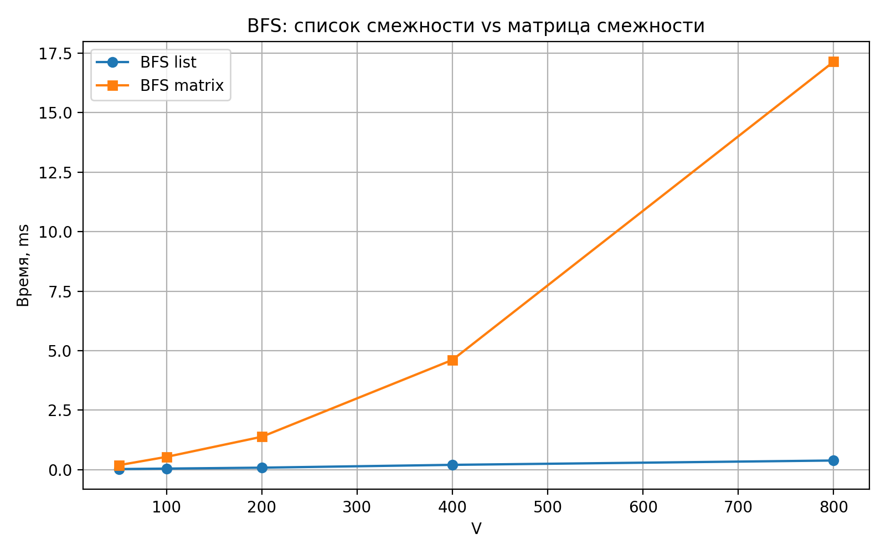
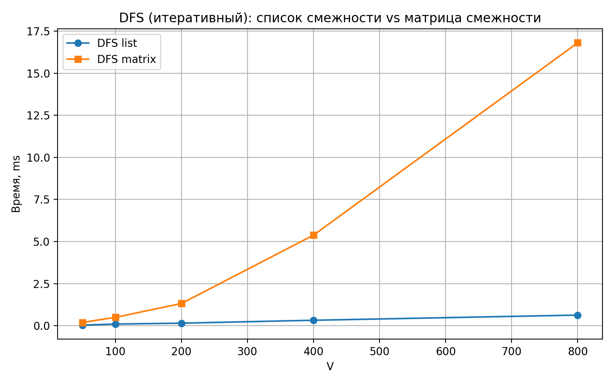
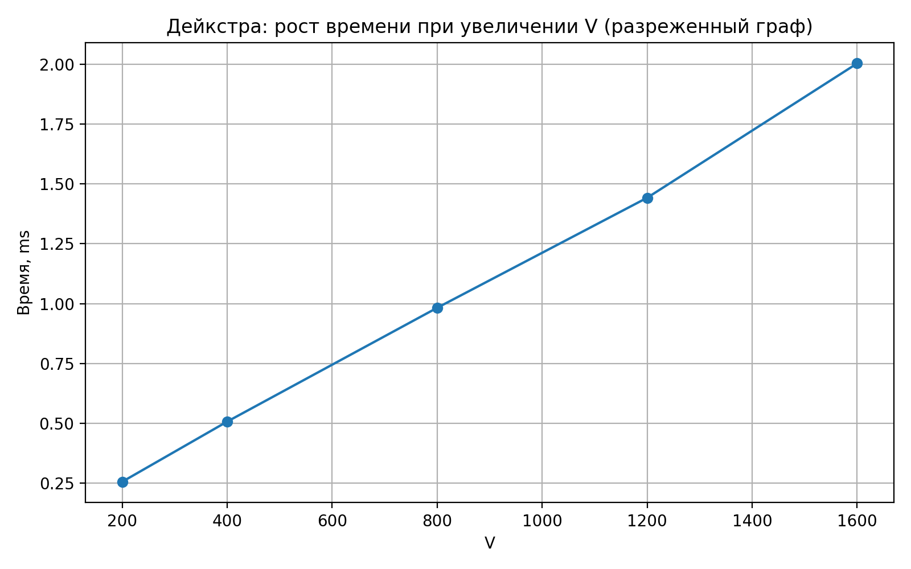
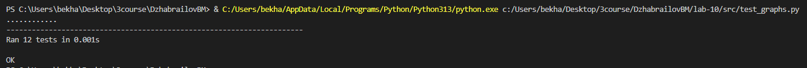

# Отчет по лабораторной работе 10
# Введение в алгоритмы. Сложность. Поиск.  


**Дата:** 2025-10-25  
**Семестр:** 5 семестр  
**Группа:** ПИЖ-б-о-23-1(1)  
**Дисциплина:** Анализ сложности алгоритмов  
**Студент:** Джабраилов Бекхан Магомедович  

---
## Цель работы
Изучить основные понятия теории графов и алгоритмы работы с ними. Освоить
представления графов в памяти и основные алгоритмы обхода. Получить практические навыки
реализации алгоритмов на графах и анализа их сложности

---
## Теория (кратко):  
**Граф:** Множество вершин (узлов) и рёбер (связей) между ними. Виды: ориентированные/
неориентированные, взвешенные/невзвешенные.    

**Представление графов:**   
* Матрица смежности: O(V²) памяти, быстрая проверка ребра.
* Список смежности: O(V + E) памяти, эффективный обход соседей.

**Обход графов:**   
* Поиск в ширину (BFS): находит кратчайшие пути в невзвешенном графе, сложность O(V + E).
* Поиск в глубину (DFS): обход с возвратом, сложность O(V + E).    

**Алгоритмы на графах:** 
*  Топологическая сортировка: для ориентированных ациклических графов (DAG).  
*  Поиск компонент связности.
*  Алгоритм Дейкстры: кратчайшие пути во взвешенном графе с неотрицательными весами.     
---
## Практическая часть
### Выполненные задачи:
1. Реализованы различные представления графов (матрица смежности, список смежности).
2. Реализованы алгоритмы обхода графов (BFS, DFS).
3. Реализованы алгоритмы поиска кратчайших путей и компонент связности.
4. Проведен сравнительный анализ эффективности разных представлений графов.
5. Решены практические задачи на графах.    


### Ключевые фрагменты кода <br></br>
Поиск в ширину:       
*graph_traversal.py:*   
```python
@dataclass(frozen=True)
class BFSResult:

    distances: List[Optional[int]]
    parent: List[Optional[int]]


def bfs(graph: Graph, start: int) -> BFSResult:

    n = graph.num_vertices()
    if start < 0 or start >= n:
        raise IndexError('start вне диапазона.')

    distances: List[Optional[int]] = [None] * n
    parent: List[Optional[int]] = [None] * n

    q: Deque[int] = deque()
    distances[start] = 0
    q.append(start)

    while q:
        u = q.popleft()
        for e in graph.neighbors(u):  # суммарно O(E) (или O(V^2) для матрицы).
            v = e.to
            if distances[v] is None:
                distances[v] = distances[u] + 1
                parent[v] = u
                q.append(v)

    return BFSResult(distances=distances, parent=parent)
```
---
Поиск в глубину:   
*graph_traversal.py:*
```python
def dfs_recursive(graph: Graph, start: int) -> List[int]:

    n = graph.num_vertices()
    if start < 0 or start >= n:
        raise IndexError('start вне диапазона.')

    visited = [False] * n
    order: List[int] = []

    def visit(u: int) -> None:
        visited[u] = True
        order.append(u)
        for e in graph.neighbors(u):
            if not visited[e.to]:
                visit(e.to)

    visit(start)
    return order
```
---
Алгоритм Дейкстры:    
*shortest_path.py:*
```python
@dataclass(frozen=True)
class DijkstraResult:

    dist: List[Optional[float]]
    parent: List[Optional[int]]


def dijkstra(graph: Graph, start: int) -> DijkstraResult:
    n = graph.num_vertices()
    if start < 0 or start >= n:
        raise IndexError('start вне диапазона.')

    dist: List[Optional[float]] = [None] * n
    parent: List[Optional[int]] = [None] * n

    dist[start] = 0.0
    pq: List[Tuple[float, int]] = [(0.0, start)]

    while pq:
        d, u = heapq.heappop(pq)
        if dist[u] is not None and d > dist[u]:
            continue

        for e in graph.neighbors(u):
            if e.weight < 0:
                raise ValueError('Дейкстра не работает отрицательными весами')
            v = e.to
            nd = d + e.weight
            if dist[v] is None or nd < dist[v]:
                dist[v] = nd
                parent[v] = u
                heapq.heappush(pq, (nd, v))

    return DijkstraResult(dist=dist, parent=parent)

```
---
Топологическая сортировка:   
*shortest_path.py:*
```python
def topo_sort_kahn(graph: Graph) -> List[int]:
    n = graph.num_vertices()
    indeg = [0] * n

    for u in range(n):
        for e in graph.neighbors(u):
            indeg[e.to] += 1

    queue: List[int] = [i for i in range(n) if indeg[i] == 0]
    head = 0
    order: List[int] = []

    while head < len(queue):
        u = queue[head]
        head += 1
        order.append(u)

        for e in graph.neighbors(u):
            v = e.to
            indeg[v] -= 1
            if indeg[v] == 0:
                queue.append(v)

    if len(order) != n:
        raise ValueError('Граф содержит цикл, топосорт невозможен.')

    return order

```
Файл с реализациями различных представлений графов
*graph_representation.py:*
```python
from __future__ import annotations

from dataclasses import dataclass
from typing import List, Optional


@dataclass(frozen=True)
class Edge:
    """Ребро графа.

    Атрибуты:
        to: конечная вершина.
        weight: вес ребра (для невзвешенного графа можно считать 1.0).
    """

    to: int
    weight: float


class GraphAdjacencyMatrix:
    """Граф на матрице смежности.

    Поддерживает ориентированный/неориентированный и взвешенный граф.
    Отсутствие ребра — None в матрице.

    Память:
        O(V^2), где V — число вершин.
    """

    def __init__(self, num_vertices: int, directed: bool = False) -> None:
        if num_vertices <= 0:
            raise ValueError('num_vertices должно быть положительным.')
        self.directed = directed
        self._n = num_vertices
        self._matrix: List[List[Optional[float]]] = [
            [None] * num_vertices for _ in range(num_vertices)
        ]  # O(V^2).

    def num_vertices(self) -> int:
        """Возвращает число вершин. O(1)."""
        return self._n

    def add_vertex(self) -> int:
        """Добавляет вершину и возвращает её индекс.

        Сложность:
            O(V) на расширение каждой строки + O(V) на новую строку => O(V).
        """
        for row in self._matrix:
            row.append(None)
        self._n += 1
        self._matrix.append([None] * self._n)
        return self._n - 1

    def add_edge(self, u: int, v: int, weight: float = 1.0) -> None:
        """Добавляет ребро u->v (и v->u если граф неориентированный). O(1)."""
        self._validate_vertex(u)
        self._validate_vertex(v)
        self._matrix[u][v] = float(weight)
        if not self.directed:
            self._matrix[v][u] = float(weight)

    def remove_edge(self, u: int, v: int) -> None:
        """Удаляет ребро u->v (и v->u если граф неориентированный). O(1)."""
        self._validate_vertex(u)
        self._validate_vertex(v)
        self._matrix[u][v] = None
        if not self.directed:
            self._matrix[v][u] = None

    def has_edge(self, u: int, v: int) -> bool:
        """Проверка наличия ребра. O(1)."""
        self._validate_vertex(u)
        self._validate_vertex(v)
        return self._matrix[u][v] is not None

    def neighbors(self, u: int) -> List[Edge]:
        """Возвращает список соседей вершины u.

        Сложность:
            O(V), т.к. нужно пройти всю строку матрицы.
        """
        self._validate_vertex(u)
        result: List[Edge] = []
        for v, w in enumerate(self._matrix[u]):
            if w is not None:
                result.append(Edge(to=v, weight=w))
        return result

    def memory_cells(self) -> int:
        """Оценка памяти как число ячеек матрицы. O(1)."""
        return self._n * self._n

    def _validate_vertex(self, v: int) -> None:
        """Проверка допустимости индекса вершины. O(1)."""
        if v < 0 or v >= self._n:
            raise IndexError('Вершина вне диапазона.')


class GraphAdjacencyList:
    """Граф на списках смежности.

    adj[u] = список рёбер из u.

    Память:
        O(V + E), где E — число рёбер.

    Преимущества:
        - Быстрый обход соседей за O(deg(u)).
        - Эффективно по памяти на разреженных графах.

    Недостатки:
        - Проверка наличия ребра u->v может быть O(deg(u)).
    """

    def __init__(self, num_vertices: int, directed: bool = False) -> None:
        if num_vertices <= 0:
            raise ValueError('num_vertices должно быть положительным.')
        self.directed = directed
        self._adj: List[List[Edge]] = [[] for _ in range(num_vertices)]

    def num_vertices(self) -> int:
        """Возвращает число вершин. O(1)."""
        return len(self._adj)

    def add_vertex(self) -> int:
        """Добавляет вершину, возвращает её индекс. O(1) амортизированно."""
        self._adj.append([])
        return self.num_vertices() - 1

    def add_edge(self, u: int, v: int, weight: float = 1.0) -> None:
        """Добавляет ребро u->v (и v->u если неориентированный). O(deg(u))."""
        self._validate_vertex(u)
        self._validate_vertex(v)
        self._add_or_replace(u, v, float(weight))
        if not self.directed:
            self._add_or_replace(v, u, float(weight))

    def remove_edge(self, u: int, v: int) -> None:
        """Удаляет ребро u->v (и v->u если неориентированный). O(deg(u))."""
        self._validate_vertex(u)
        self._validate_vertex(v)
        self._adj[u] = [e for e in self._adj[u] if e.to != v]
        if not self.directed:
            self._adj[v] = [e for e in self._adj[v] if e.to != u]

    def has_edge(self, u: int, v: int) -> bool:
        """Проверка наличия ребра. O(deg(u))."""
        self._validate_vertex(u)
        self._validate_vertex(v)
        return any(e.to == v for e in self._adj[u])

    def neighbors(self, u: int) -> List[Edge]:
        """Соседи вершины u. O(deg(u)) на копирование списка."""
        self._validate_vertex(u)
        return list(self._adj[u])

    def edges_count(self) -> int:
        """Возвращает число ориентированных рёбер (внутреннее). O(V + E)."""
        return sum(len(lst) for lst in self._adj)

    def memory_units(self) -> int:
        """Грубая оценка памяти: V + E(ориент). O(V + E)."""
        v = self.num_vertices()
        e = self.edges_count()
        return v + e

    def _add_or_replace(self, u: int, v: int, weight: float) -> None:
        """Добавляет ребро или обновляет вес, если ребро уже было O(deg(u))."""
        for i, e in enumerate(self._adj[u]):
            if e.to == v:
                self._adj[u][i] = Edge(to=v, weight=weight)
                return
        self._adj[u].append(Edge(to=v, weight=weight))

    def _validate_vertex(self, v: int) -> None:
        """Проверка допустимости индекса вершины. O(1)."""
        if v < 0 or v >= self.num_vertices():
            raise IndexError('Вершина вне диапазона.')

```
Файл с выполненными практическими заданиями
*tasks.py:*
```python
from __future__ import annotations

from dataclasses import dataclass
from typing import List, Tuple


from graph_representation import GraphAdjacencyList
from graph_traversal import bfs, reconstruct_path


@dataclass(frozen=True)
class Maze:
    """Лабиринт в виде прямоугольной сетки.

    grid[r][c] == 0 -> свободно
    grid[r][c] == 1 -> стена
    """

    grid: List[List[int]]

    def rows(self) -> int:
        return len(self.grid)

    def cols(self) -> int:
        return len(self.grid[0]) if self.grid else 0


def shortest_path_in_maze(
    maze: Maze,
    start: Tuple[int, int],
    goal: Tuple[int, int],
) -> List[Tuple[int, int]]:
    """Кратчайший путь в лабиринте (BFS по клеткам).

    Сложность:
        O(R*C) по вершинам сетки и рёбрам между соседними клетками.
    """
    r_count = maze.rows()
    c_count = maze.cols()
    if r_count == 0 or c_count == 0:
        return []

    def inside(r: int, c: int) -> bool:
        return 0 <= r < r_count and 0 <= c < c_count

    sr, sc = start
    gr, gc = goal
    if not inside(sr, sc) or not inside(gr, gc):
        return []
    if maze.grid[sr][sc] == 1 or maze.grid[gr][gc] == 1:
        return []

    # Нумеруем клетки в вершины графа.
    def vid(r: int, c: int) -> int:
        return r * c_count + c

    def cell(v: int) -> Tuple[int, int]:
        return divmod(v, c_count)

    n = r_count * c_count
    g = GraphAdjacencyList(n, directed=False)

    # Строим граф смежности по 4 направлениям.
    for r in range(r_count):
        for c in range(c_count):
            if maze.grid[r][c] == 1:
                continue
            u = vid(r, c)
            for dr, dc in ((1, 0), (-1, 0), (0, 1), (0, -1)):
                nr, nc = r + dr, c + dc
                if inside(nr, nc) and maze.grid[nr][nc] == 0:
                    v = vid(nr, nc)
                    g.add_edge(u, v, 1.0)

    res = bfs(g, vid(sr, sc))
    path_vertices = reconstruct_path(res.parent, vid(sr, sc), vid(gr, gc))
    return [cell(v) for v in path_vertices]


def is_network_connected(num_vertices: int, edges: List[Tuple[int,
                                                              int]]) -> bool:
    """Задача: определить связность сети (неориентированный граф).

    Сложность:
        Построение O(V + E), BFS O(V + E).
    """
    if num_vertices <= 0:
        return False

    g = GraphAdjacencyList(num_vertices, directed=False)
    for u, v in edges:
        g.add_edge(u, v, 1.0)

    res = bfs(g, 0)
    return all(d is not None for d in res.distances)


def find_dependencies_order(
    num_vertices: int,
    directed_edges: List[Tuple[int, int]],
) -> List[int]:
    """Задача: порядок выполнения задач по зависимостям (топосорт).

    Вершины 0..num_vertices-1, ребро u->v означает: u должен быть раньше v.

    Сложность:
        O(V + E).
    """
    from shortest_path import topo_sort_kahn  # локальный импорт

    g = GraphAdjacencyList(num_vertices, directed=True)
    for u, v in directed_edges:
        g.add_edge(u, v, 1.0)
    return topo_sort_kahn(g)


def format_edges(edges: List[Tuple[int, int]]) -> str:
    """Печатает список рёбер в удобном виде."""
    if not edges:
        return "(нет рёбер)"
    return ", ".join(f"{u}—{v}" for u, v in edges)


def format_toposort(order: List[int]) -> str:
    """Печатает порядок задач с русскими пояснениями."""
    return " → ".join(str(v) for v in order) if order else "(порядок пуст)"

```
Это основные файлы, все остальное в папке src
---

## Результаты выполнения

### Пример работы программы
```bash

Характеристики ПК для тестирования:       
- Процессор: Intel Core i5-11400 @ 2.60GHz
- Оперативная память: 16 GB
- ОС: Windows 10 x64
- Python: 3.13.3

================================================================================
Эксперимент: сравнение представлений графа (BFS/DFS)
================================================================================
V=  50: bfs_list=   0.025 ms, bfs_mat=   0.188 ms
V= 100: bfs_list=   0.045 ms, bfs_mat=   0.538 ms
V= 200: bfs_list=   0.084 ms, bfs_mat=   1.382 ms
V= 400: bfs_list=   0.202 ms, bfs_mat=   4.611 ms
V= 800: bfs_list=   0.384 ms, bfs_mat=  17.139 ms
================================================================================
Эксперимент: Дейкстра (масштабируемость)
================================================================================
V= 200, E≈   800 =>    0.256 ms
V= 400, E≈  1600 =>    0.507 ms
V= 800, E≈  3200 =>    0.982 ms
V=1200, E≈  4800 =>    1.442 ms
V=1600, E≈  6400 =>    2.003 ms

================================================================================
Практические задачи: лабиринт/связность сети/зависимости
================================================================================

№ 1: найти кратчайший путь в лабиринте (BFS по клеткам)
Старт: (0, 0), Финиш: (3, 3)

Найденный путь (координаты):
  (0, 0) → (0, 1) → (1, 1) → (2, 1) → (2, 2) → (2, 3) → (3, 3)

Лабиринт с отмеченным путём (*):

Длина пути (число шагов): 6

--------------------------------------------------------------------------------
№ 2: проверить, связна ли сеть (компьютеры и кабели)
Число компьютеров: 5
Кабели (соединения): 0—1, 1—2, 2—3, 3—4
Результат: сеть СВЯЗНА (каждый компьютер достижим из другого).

--------------------------------------------------------------------------------
№ 3: порядок выполнения задач при наличии зависимостей (топосорт)
Число задач: 4 (задачи 0..3)
Зависимости u → v (u должно быть выполнено раньше v):
  0 → 1
  1 → 2
  0 → 3

Корректный порядок выполнения:
  0 → 1 → 3 → 2

Проверка смысла:
  - задача 0 стоит раньше задач 1 и 3;
  - задача 1 стоит раньше задачи 2.
```

### Тестирование
Unit тесты из файла test_graphs.py пройдены успешно, скриншот в приложениях

## Выводы
1. Сравнительный анализ эффективности различных представлений графов показал четкую зависимость производительности от 
структуры данных. Матрица смежности демонстрирует квадратичный рост потребления памяти O(V²), что делает ее непрактичной 
для работы с крупными разреженными графами. Список смежности, в свою очередь, обладает линейной сложностью по памяти O(V + E) 
и показывает значительно лучшую производительность при обходе графа, особенно для разреженных структур.   

2.  Поиск в ширину (BFS) идеально подходит для задач нахождения кратчайшего пути в невзвешенных графах и анализа компонент 
связности, гарантируя оптимальность решения. Поиск в глубину (DFS), напротив, более эффективен для задач проверки ацикличности, 
топологической сортировки и анализа структур с глубокой вложенностью, хотя и не обеспечивает кратчайший путь. Алгоритм Дейкстры 
эффективен для работы со взвешенными графами, показывая хорошую производительность O((V+E)logV) при решении задач маршрутизации 
и планирования.    


## Ответы на контрольные вопросы
## Контрольные вопросы темы 10

1. **В чем разница между представлением графа в виде матрицы смежности и списка смежности?
Сравните их по потреблению памяти и сложности операций.**   

Матрица смежности представляет граф в виде двумерного массива размером V×V, где элемент matrix[i][j] указывает на наличие 
и вес ребра между вершинами i и j. Список смежности хранит для каждой вершины список смежных с ней вершин.

Потребление памяти:

* Матрица смежности: O(V²) - всегда занимает квадратичный объем памяти.   
* Список смежности: O(V + E) - зависит от количества вершин и рёбер.   

Сложность операций:
* Добавление ребра: O(1) в обоих случаях.
* Проверка наличия ребра: O(1) для матрицы, O(deg(v)) для списка.
* Обход соседей вершины: O(V) для матрицы, O(deg(v)) для списка.
* BFS/DFS: O(V²) для матрицы, O(V + E) для списка.

---
2. **Опишите алгоритм поиска в ширину (BFS). Для решения каких задач он применяется?**   

Ключевая особенность алгоритма поиска в ширину — постепенное исследование всех узлов на одном уровне глубины перед 
переходом к следующему. обход начинается с посещения определённой вершины (для обхода всего графа часто выбирается 
произвольная вершина). Затем алгоритм посещает соседей этой вершины, за ними — соседей соседей, и так далее.  BFS применяется 
для решения задач, где важно найти кратчайший путь в невзвешенном графе. Под кратчайшим путём подразумевается путь, 
содержащий наименьшее число рёбер.

---
3. **Чем поиск в глубину (DFS) отличается от BFS? Какие дополнительные задачи (например, проверка
на ацикличность) можно решить с помощью DFS?**   

DFS (поиск в глубину) и BFS (поиск в ширину) отличаются подходом к обходу графов. DFS исследует граф «вглубь», прежде чем 
возвращаться и исследовать альтернативные пути, а BFS — «по уровням».   

С помощью DFS можно решить, например:
* Проверку графа на ацикличность — граф является ациклическим, когда во время выполнения поиска в глубину не встречаются 
обратные ссылки (или нисходящие).
* Топологическую сортировку — запустить серию поисков в глубину, чтобы обойти все вершины графа, и отсортировать вершины 
по времени выхода по убыванию — это и будет ответом.
* Поиск компонент сильной связности — сначала сделать топологическую сортировку, потом транспонировать граф и провести 
снова серию поисков в глубину в порядке, определяемом топологической сортировкой. Каждое дерево поиска — сильносвязная 
компонента.

---
4. **Как алгоритм Дейкстры находит кратчайшие пути во взвешенном графе? Почему он не работает с
отрицательными весами ребер?**    

Алгоритм Дейкстры находит кратчайшие пути от стартовой вершины до всех остальных во взвешенном графе с неотрицательными весами. 
Он использует жадную стратегию с приоритетной очередью, на каждом шаге выбирая вершину с минимальным текущим расстоянием.  

Причины неработоспособности с отрицательными весами:
* Жадный выбор становится неоптимальным - вершина, выбранная как имеющая минимальное расстояние, может позже получить 
еще меньшее расстояние через ребро с отрицательным весом.
* Отсутствие механизма перерасчета уже обработанных вершин.
* Возможность образования циклов с отрицательным суммарным весом, где путь можно бесконечно улучшать.

---
5. **Что такое топологическая сортировка и для каких графов она применима? Приведите пример
задачи, где она используется.**  

Топологическая сортировка — это линейное упорядочивание вершин ориентированного ациклического графа, при котором для 
каждого ребра (u → v) вершина u предшествует вершине v в полученной последовательности. Если одна вершина зависит от 
другой (например, одна задача должна быть выполнена до другой), то в топологическом порядке зависимая вершина будет 
стоять позже. Топологическая сортировка применима только к ориентированным ациклическим графам. Если в графе есть цикл 
(например, A зависит от B, B от C, а C от A), то корректная линейная зависимость невозможна, и топологическую сортировку 
построить нельзя.    
Задачи, в которых используется топологическая сортировка: планирование задач и процессов, построение учебного плана и т.д.


---


## Графики производительности
   


