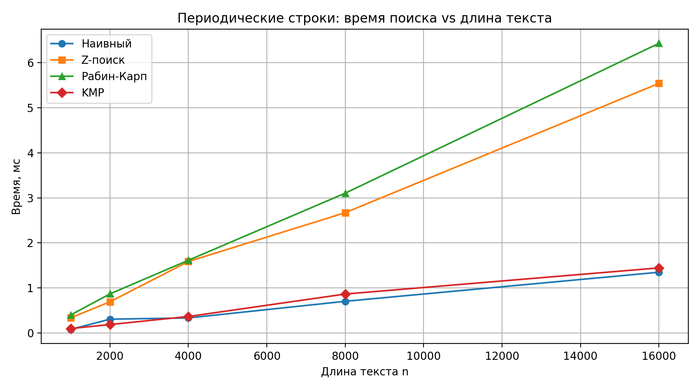
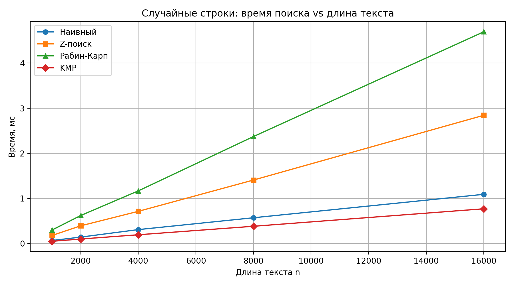
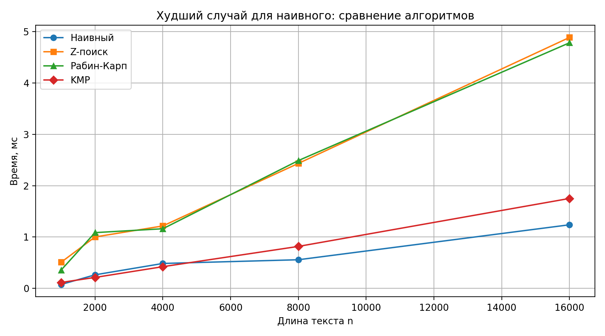

# Отчет по лабораторной работе 11
# Введение в алгоритмы. Сложность. Поиск.  


**Дата:** 2025-10-25  
**Семестр:** 5 семестр  
**Группа:** ПИЖ-б-о-23-1(1)  
**Дисциплина:** Анализ сложности алгоритмов  
**Студент:** Джабраилов Бекхан Магомедович  

---
## Цель работы
Изучить специализированные алгоритмы для эффективной работы со строками. Освоить
методы поиска подстрок, вычисление префикс-функции и Z-функции. Получить практические навыки
реализации и анализа алгоритмов обработки строк, исследовать их производительность.  

---
## Теория (кратко):  
**Префикс-функция:** Для строки S длиной n - массив π[0..n-1], где π[i] - длина наибольшего
собственного префикса, который является суффиксом подстроки S[0..i]. Сложность вычисления:
O(n).    

**Алгоритм Кнута-Морриса-Пратта (KMP):** Эффективный алгоритм поиска подстроки,
использующий префикс-функцию. Сложность: O(n + m).  

**Z-функция:** Для строки S длиной n - массив z[0..n-1], где z[i] - длина наибольшего общего
префикса строки S и суффикса S[i..n-1]. Сложность вычисления: O(n).    

**Поиск подстроки:** Помимо KMP существуют алгоритмы Бойера-Мура, Рабина-Карпа, каждый со
своими особенностями и областью применения.      

---
## Практическая часть
### Выполненные задачи:
1. Реализовано вычисление префикс-функции для строки.
2. Реализован алгоритм Кнута-Морриса-Пратта для поиска подстроки.
3. Реализовано вычисление Z-функции.
4. Реализован один из дополнительных алгоритмов поиска подстроки.
5. Проведен сравнительный анализ эффективности алгоритмов на различных данных.
---
### Ключевые фрагменты кода <br></br>
Алгоритм Кнута-Морриса-Пратта (KMP):       
*kmp_search.py:*   
```python
def kmp_search_all(text: str, pattern: str) -> List[int]:

    if pattern == "":
        return list(range(len(text) + 1))

    m = len(pattern)
    pi = prefix_function(pattern)

    result: List[int] = []
    j = 0  # длина совпавшего префикса pattern

    for i in range(len(text)):
        while j > 0 and text[i] != pattern[j]:
            j = pi[j - 1]

        if text[i] == pattern[j]:
            j += 1

        if j == m:
            result.append(i - m + 1)
            j = pi[j - 1]

    return result
```

---
Наивный поиск    
*string_matching.py:*
```python

def naive_search_all(text: str, pattern: str) -> List[int]:
    """Наивный поиск всех вхождений pattern в text.

    Временная сложность: O(n * m) в худшем случае.
    Пространственная сложность: O(1) доп.памяти.
    """
    if pattern == "":
        return list(range(len(text) + 1))

    n = len(text)
    m = len(pattern)
    result: List[int] = []

    for i in range(0, n - m + 1):
        if text[i: i + m] == pattern:
            result.append(i)

    return result

```

---
Алгорит Рабина-Карпа (Дополнительный алгоритм):    
*string_matching.py:*
```python
def rabin_karp_search_all(
    text: str,
    pattern: str,
    params: RabinKarpParams | None = None,
) -> List[int]:

    if pattern == "":
        return list(range(len(text) + 1))
    if params is None:
        params = RabinKarpParams()

    n = len(text)
    m = len(pattern)
    if m > n:
        return []

    base = params.base
    mod = params.mod

    # Предвычислим base^(m-1) mod mod
    high = 1
    for _ in range(m - 1):
        high = (high * base) % mod.

    def char_code(ch: str) -> int:
        return ord(ch) + 1.

    # Хеш pattern и первого окна text
    pat_hash = 0
    win_hash = 0
    for i in range(m):
        pat_hash = (pat_hash * base + char_code(pattern[i])) % mod
        win_hash = (win_hash * base + char_code(text[i])) % mod

    result: List[int] = []

    def check(pos: int) -> bool:
        return text[pos: pos + m] == pattern

    for i in range(0, n - m + 1):
        if win_hash == pat_hash and check(i):
            result.append(i)

        if i < n - m:
            left = char_code(text[i])
            right = char_code(text[i + m])

            # Удаляем левый символ и добавляем правый
            win_hash = (win_hash - left * high) % mod
            win_hash = (win_hash * base + right) % mod

```
---
Префикс-функция:   
*prefix_function.py:*
```python
from __future__ import annotations

from typing import List


def prefix_function(s: str) -> List[int]:

    n = len(s)
    pi: List[int] = [0] * n

    j = 0
    for i in range(1, n):
        while j > 0 and s[i] != s[j]:
            j = pi[j - 1]

        if s[i] == s[j]:
            j += 1

        pi[i] = j

    return pi


```
---
Z-функция:    
*z_function.py:*
```python
def z_function(s: str) -> List[int]:

    n = len(s)
    z: List[int] = [0] * n
    l: Literal[0]
    r = 0

    for i in range(1, n):
        if i <= r:
            z[i] = min(r - i + 1, z[i - l])

        while i + z[i] < n and s[z[i]] == s[i + z[i]]:
            z[i] += 1

        if i + z[i] - 1 > r:
            l = i
            r = i + z[i] - 1

    return z
```
---

Практические задачи    
*tasks.py:*
```python
from __future__ import annotations

from typing import List

from kmp_search import kmp_search_all
from prefix_function import prefix_function
from string_matching import SearchMethod, search_all
from z_function import z_function


def task_find_all_occurrences(text: str, pattern: str,
                              method: SearchMethod) -> List[int]:
    """Практическая задача 1: найти все вхождения pattern в text алгоритмом."""
    if method == "z" or method == "rabin_karp" or method == "naive":
        return search_all(text, pattern, method)
    return kmp_search_all(text, pattern)


def smallest_period_prefix(s: str) -> int:
    """Практическая задача 2: найти период строки (через префикс-функцию).

    Если строка s состоит из повторения некоторой подстроки p,
    то длина периода = n - π[n-1], и n % period == 0.

    Временная сложность: O(n).
    """
    n = len(s)
    if n == 0:
        return 0

    pi = prefix_function(s)
    period = n - pi[n - 1]

    if period != 0 and n % period == 0:
        return period

    return n


def smallest_period_z(s: str) -> int:
    """Практическая задача 2 (альтернатива): период строки через Z-функцию.

    Ищем минимальное k такое, что:
        k | n и z[k] >= n - k.
    Временная сложность: O(n) + O(n) проверки => O(n).
    """
    n = len(s)
    if n == 0:
        return 0

    z = z_function(s)
    for k in range(1, n):
        if n % k == 0 and z[k] >= n - k:
            return k
    return n


def is_cyclic_shift(a: str, b: str, method: SearchMethod = "z") -> bool:
    """Практическая задача 3: проверка циклического сдвига.

    a и b — циклические сдвиги тогда и только тогда, когда:
        len(a) == len(b) и a встречается в (b + b).

    Временная сложность:
        зависит от выбранного метода поиска.
    """
    if len(a) != len(b):
        return False
    if a == "":
        return True

    doubled = b + b
    occurrences = search_all(doubled, a, method)  # зависит от метода.
    return len(occurrences) > 0

```
---
Это основные файлы, все остальное в папке src
---

## Результаты выполнения

### Пример работы программы
```bash

Характеристики ПК для тестирования:
- Процессор: Intel Core i5-11400 @ 2.60GHz
- Оперативная память: 16 GB
- ОС: Windows 10 x64
- Python: 3.13.3


================================================================================
Случайные строки: поиск паттерна в тексте
================================================================================
n=  1000, m=  25 | naive=   0.0662 ms | z=   0.1773 ms | rk=   0.2978 ms | kmp=   0.0484 ms
n=  2000, m=  25 | naive=   0.1417 ms | z=   0.3919 ms | rk=   0.6205 ms | kmp=   0.0991 ms
n=  4000, m=  25 | naive=   0.3079 ms | z=   0.7130 ms | rk=   1.1667 ms | kmp=   0.1935 ms
n=  8000, m=  25 | naive=   0.5705 ms | z=   1.4068 ms | rk=   2.3710 ms | kmp=   0.3817 ms
n= 16000, m=  25 | naive=   1.0901 ms | z=   2.8423 ms | rk=   4.6937 ms | kmp=   0.7694 ms

================================================================================
Периодические строки: много повторов
================================================================================
n=  1000, m=  25 | naive=   0.0808 ms | z=   0.3369 ms | rk=   0.4019 ms | kmp=   0.0989 ms
n=  2000, m=  25 | naive=   0.3068 ms | z=   0.6929 ms | rk=   0.8685 ms | kmp=   0.1876 ms
n=  4000, m=  25 | naive=   0.3345 ms | z=   1.5876 ms | rk=   1.6147 ms | kmp=   0.3662 ms
n=  8000, m=  25 | naive=   0.7040 ms | z=   2.6715 ms | rk=   3.1047 ms | kmp=   0.8652 ms
n= 16000, m=  25 | naive=   1.3495 ms | z=   5.5419 ms | rk=   6.4313 ms | kmp=   1.4455 ms

================================================================================
Худший случай для наивного поиска
================================================================================
n=  1000, m=  25 | naive=   0.0756 ms | z=   0.5092 ms | rk=   0.3573 ms | kmp=   0.1155 ms
n=  2000, m=  25 | naive=   0.2640 ms | z=   1.0019 ms | rk=   1.0862 ms | kmp=   0.2131 ms
n=  4000, m=  25 | naive=   0.4851 ms | z=   1.2162 ms | rk=   1.1615 ms | kmp=   0.4224 ms
n=  8000, m=  25 | naive=   0.5577 ms | z=   2.4346 ms | rk=   2.4899 ms | kmp=   0.8176 ms
n= 16000, m=  25 | naive=   1.2387 ms | z=   4.8887 ms | rk=   4.7847 ms | kmp=   1.7518 ms

Итог:
  - KMP и Z-поиск показывают линейный рост и стабильное поведение.
  - Наивный алгоритм резко замедляется на повторяющихся данных.
  - Рабин-Карп обычно быстрый, но теоретически имеет худший случай

================================================================================
1) Визуализация префикс-функции и Z-функции
================================================================================
Строка: abacaba

Префикс-функция (π):
Индексы:  0  1  2  3  4  5  6
Символы: a  b  a  c  a  b  a
π(i):    0  0  1  0  1  2  3

Z-функция (z):
Индексы:  0  1  2  3  4  5  6
Символы: a  b  a  c  a  b  a
z(i):    0  0  1  0  3  0  1

================================================================================
2) Поиск подстроки разными алгоритмами
================================================================================
Текст:    abracadabra abracadabra
Паттерн:  abra

Наивный поиск: [0, 7, 12, 19]
Поиск по Z-функции: [0, 7, 12, 19]
Рабин-Карп: [0, 7, 12, 19]
KMP: [0, 7, 12, 19]

================================================================================
3) Практические задачи (3+)
================================================================================
Задача 1: все вхождения паттерна в тексте
  Текст: aaaaa
  Паттерн: aa
  Метод naive    : [0, 1, 2, 3]
  Метод z        : [0, 1, 2, 3]
  Метод rabin_karp: [0, 1, 2, 3]
  Метод kmp      : [0, 1, 2, 3]

Задача 2: период строки
  Строка: abcabcabcabc
  Период через π: 3
  Период через z: 3

Задача 3: проверка циклического сдвига
  a: waterbottle
  b: erbottlewat
  Результат (поиск по Z): True
  Результат (Рабин-Карп): True

```

### Тестирование
Unit тесты из файла test_string_algorithms.py пройдены успешно, скриншот в приложениях

## Выводы
1. В ходе выполнения лабораторной работы были изучены и реализованы основные алгоритмы обработки строк, включая префикс-функцию, 
Z-функцию, алгоритм Кнута–Морриса–Пратта, а также дополнительные методы поиска подстрок. 
Реализации продемонстрировали линейную временную сложность и стабильную работу даже на строках с большим количеством повторов.  

2.  Были рассмотрены и решены практические задачи, такие как поиск всех вхождений подстроки, 
определение периода строки, проверка циклического сдвига, поиск самой длинной палиндромной подстроки, 
самой длинной общей подстроки и подсчёт количества различных подстрок. 
Это позволило показать универсальность строковых алгоритмов и их применение в задачах анализа текста.  

3. Сравнительный анализ показал, что наивные алгоритмы значительно проигрывают специализированным методам (KMP, Z-поиск) 
на неблагоприятных входных данных, тогда как линейные алгоритмы сохраняют эффективность. 
В целом, строковые алгоритмы являются важным инструментом в программировании и находят широкое применение в задачах поиска, 
анализа и обработки текстовой информации.   


## Ответы на контрольные вопросы
## Контрольные вопросы темы 11

1. **Что такое префикс-функция строки? Как она используется в алгоритме Кнута-Морриса-Пратта
 (KMP)?**   

Префикс-функция строки pi для строки S длиной n - это массив pi той же длины, где pi[i] равно длине самого длинного 
собственного префикса строки S[0...i], который также является суффиксом этой же подстроки S[0...i].   

Алгоритм KMP предназначен для эффективного поиска вхождения подстроки P (паттерн) в тексте T. Префикс-функция pi 
вычисляется для подстроки P. Она позволяет избежать избыточных сравнений символов при совпадении части паттерна с текстом.

---
2. **В чем основное преимущество алгоритма KMP перед наивным алгоритмом поиска подстроки?
Проиллюстрируйте на примере.**   

Основное преимущество: KMP избегает многократного пересмотра одних и тех же символов текста. Наивный алгоритм при каждом 
несовпадении сдвигает паттерн на 1 позицию и начинает сравнение заново, что может приводить к O(mn) сравнениям, где 
n - длина текста, m - длина паттерна. KMP, используя префикс-функцию, сдвигает паттерн, гарантируя, что каждый символ 
текста будет рассмотрен не более одного раза (или очень ограниченное число раз, в зависимости от точной реализации и анализа).  

Текст: "AAAAB"
Образец: "AAA"

Наивный алгоритм: 9 сравнений (многократно проверяет одни и те же 'A')   
KMP: 5 сравнений (движется только вперед по тексту)

---
3. **Опишите, что такое Z-функция строки. Как с ее помощью можно решить задачу поиска
подстроки?**   

Z-функция строки — это массив, каждый элемент которого равен длине максимальной подстроки, начинающейся с определённой 
позиции и равной префиксу исходной строки. Иными словами, Z-функция — это вектор длин наибольшего общего префикса строки 
с её суффиксом. 

Чтобы найти подстроку в строке с помощью Z-функции, нужно выполнить следующие шаги:
* Определить длину текста (n) и образца (m).
* Образовать строку s = pattern + # + text, где # — символ, не встречающийся ни в text, ни в pattern.
* Вычислить Z-функцию от этой строки.
* В полученном массиве в позициях, в которых значение Z-функции равно длине образца, начинается подстрока, совпадающая с pattern.

---
4. **В чем заключается идея алгоритма Бойера-Мура? Какие эвристики он использует для ускорения
поиска?**    

Идея алгоритма Бойера-Мура заключается в том, чтобы не просто сравнивать шаблон с текстом, а эффективно избегать 
бесполезных сравнений. 

Для ускорения поиска алгоритм использует две эвристики:
* Эвристика плохого символа. Если при сравнении шаблона с текстом найден символ, который не совпадает с соответствующим 
символом шаблона, то шаблон сдвигают так, чтобы этот «плохой» символ выровнялся с последним его вхождением в шаблоне. 
Если его нет — можно двигаться дальше. Это снижает количество ненужных сравнений, особенно если в тексте часто встречаются 
«лишние» символы.
* Эвристика хорошего суффикса. Если часть шаблона уже совпала с текстом, но дальше произошёл сбой, можно поискать, 
встречается ли совпавший суффикс где-то ещё в шаблоне. Если да — шаблон двигают туда. Если нет — можно сделать прыжок 
на всю длину совпадения.   

---
5. **Для каких практических задач, помимо поиска подстроки, могут применяться префикс- и Z
функции (например, поиск периода строки)?**  

* Поиск всех вхождений образца в текст
* Нахождение количества различных подстрок в строке
* Сжатие строки
* Разбиение строки на палиндромы и т.д.

---


## Графики производительности
   


